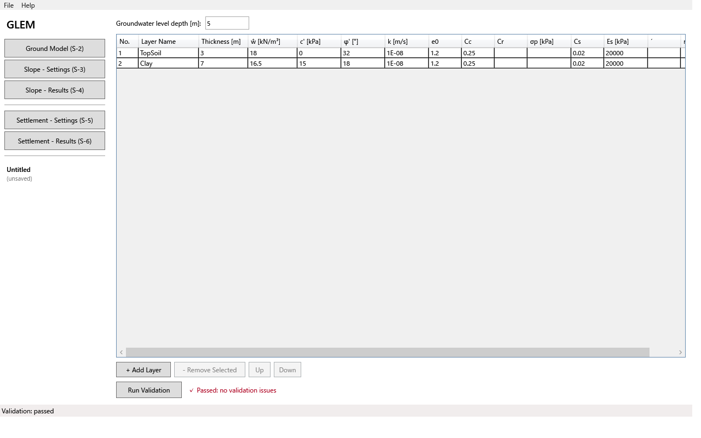
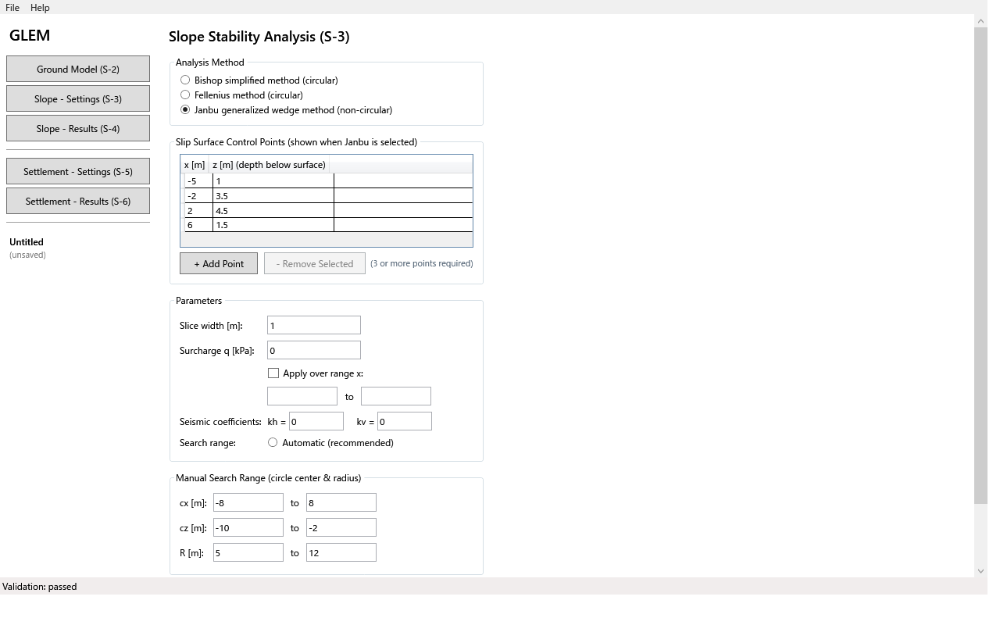
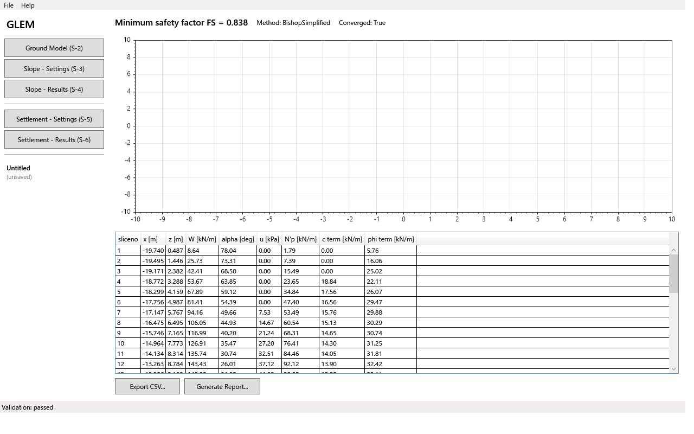
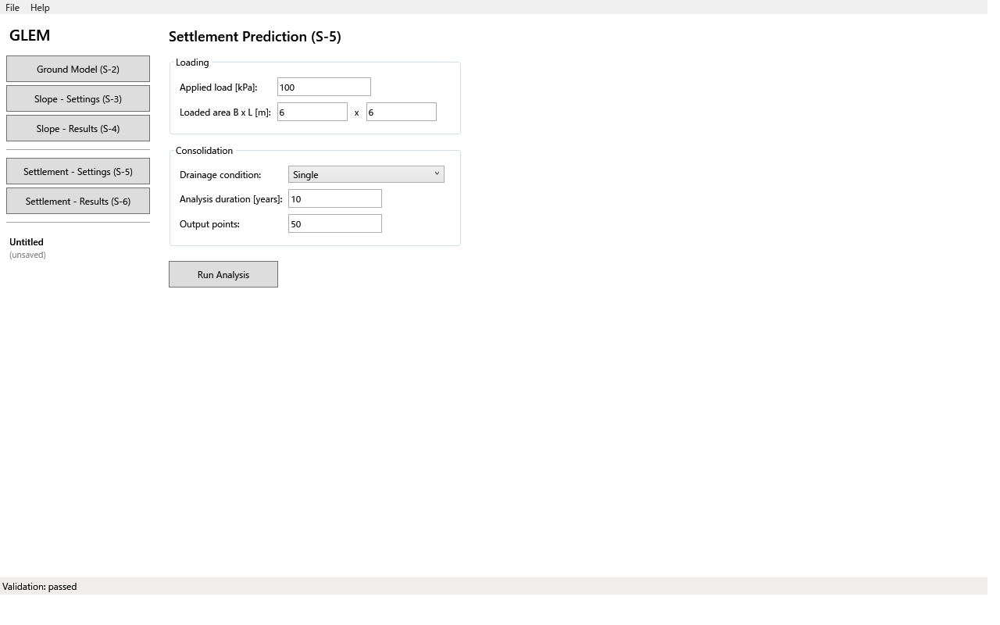
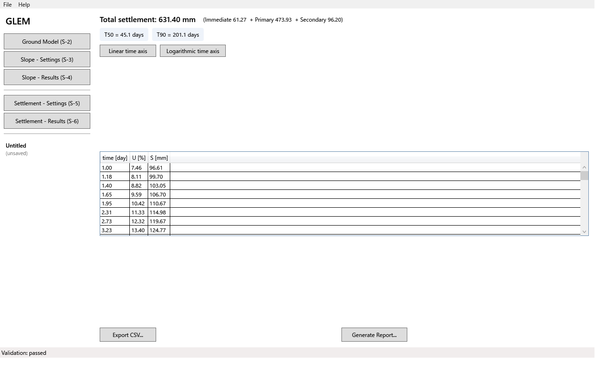

# GLEM（Generalized Limit Equilibrium Method）ユーザーマニュアル

| 項目 | 内容 |
|---|---|
| 文書名 | GLEM ユーザーマニュアル |
| ソフトウェア名称 | GLEM（Generalized Limit Equilibrium Method） |
| バージョン | 1.0.0 |
| 作成日 | 2026-08-22 |
| 最終更新日 | 2026-08-23 |
| 状態 | 完成（M4: 本文・画面キャプチャ補完済み） |
| 対象読者 | GLEM を操作する地盤工学エンジニア、教育・検証用途の利用者 |

## 改訂履歴

| バージョン | 日付 | 改訂内容 | 作成者 |
|---|---|---|---|
| 1.0 | 2026-08-22 | 章立てと概念解説部分の初版。操作手順本文は M4（実装計画書）で完成させる | - |
| 1.0.0 | 2026-08-23 | M4: 未記入だった全節を実際の UI に基づき補完（画面キャプチャ `manual/screenshots/` 参照）、FAQ 回答を追加 | GLEM 開発チーム |

> **保守ルール**: 各節の本文は実際の UI と同期させること。画面変更時は本マニュアルと `manual/screenshots/` のキャプチャを同時に更新する。

---

## 1. はじめに

### 1.1 GLEM とは

GLEM（Generalized Limit Equilibrium Method）は、地盤工学における**斜面安定解析**と**沈下予測・圧密解析**を行う Windows デスクトップソフトウェアです。限界平衡法に基づき滑動面沿いの安全率を算出するとともに、一次元圧密理論に基づき載荷による沈下量とその時間変化を評価します。

### 1.2 適用範囲と対象外

| 区分 | 内容（機能仕様書 §1.2 を継承） |
|---|---|
| できること | 斜面安定解析（円すい滑動面法・非円滑動面の一般化条体法）、沈下予測・圧密解析（一次元理論）、結果の図示と CSV/レポート出力 |
| できないこと | 二次元・三次元有限要素法解析、動的（地震応答）解析、擁壁・杭の設計計算、地下水定常流場の数値解析 |

### 1.3 前提環境

Windows 10 / 11（64bit）、メモリ 8GB 以上を推奨します（機能仕様書 §2.2）。

---

## 2. インストールと起動

### 2.1 インストール方法

GLEM は自己完結型の単一実行可能ファイル（`GLEM.exe`、.NET ランタイム同梱）として配布されます。インストーラは不要です。

1. 配布物（`dist/` の `GLEM-<version>-win-x64/GLEM.exe`）を任意のフォルダにコピーします（例: `C:\Tools\GLEM\`）。
2. `GLEM.exe` をダブルクリックして起動します。
3. （任意）開始メニューへのショートカットを作成するには、`GLEM.exe` の右クリック → 「送る」→「デスクトップ(ショートカットを作成)」等でショートカットを作り、必要に応じてピン留めしてください。

> 配布 exe は `--selftest` オプションで C-01〜C-03 のセルフチェックを実行できます（`GLEM.exe --selftest`）。全項目 `[PASS]` と終了コード 0 が正常です。

### 2.2 初回起動とメイン画面の見方

初回起動時は、既定の地盤モデル（表層土 3 m + 粘土層 7 m、地下水位 5 m）が読み込まれた状態の S-1 メイン画面が表示されます。

画面構成:

| 領域 | 内容 |
|---|---|
| 上部メニューバー | File（New / Open... / Save / Save As...）、Help（About GLEM） |
| 左ペイン（S-1 ナビゲーション） | 「GLEM」タイトル、5 つの画面遷移ボタン（Ground Model S-2 / Slope Settings S-3 / Slope Results S-4 / Settlement Settings S-5 / Settlement Results S-6）、プロジェクト名・保存先パス |
| 中央コンテンツ | 左ペインのボタンで切り替わる作業画面（S-2〜S-6） |
| 下部ステータスバー | 直近の状態表示（検証結果、自動保存時刻など） |

### 2.3 `.glem` ファイル関連付けの有効化

GLEM のプロジェクトファイルは JSON 形式の `.glem` です。Windows でダブルクリック起動できるようにするには:

1. `GLEM.exe` の右クリック →「プロパティ」→「ファイルの種類に関連付ける」は標準機能ではないため、以下を手動で行います。
2. 任意の `.glem` ファイルを右クリック →「名前の変更...」で関連付けを確認し、「他のアプリを選択」→「このコンピューターに追加して検索」から `GLEM.exe` を選択 →「常にこのアプリを使用する」にチェック → OK。

> 注: GLEM はコマンドライン引数として `.glem` パスを受け取るとそのプロジェクトを開いて起動します（`GLEM.exe C:\path\project.glem`）。関連付けがなくてもこの方法で開けます。

### 2.4 アンインストール

単一 exe のため、コピーしたフォルダ（`GLEM.exe`）を削除するだけです。次のデータは必要に応じて手動で削除してください:

| パス | 内容 |
|---|---|
| `%LOCALAPPDATA%\GLEM\autosave.glem` | 自動保存データ |
| `%LOCALAPPDATA%\GLEM\logs\` | ログファイル（詳細設計書 §7） |

---

## 3. プロジェクトの基本操作

### 3.1 プロジェクトの新規作成（R-3.1.1）

メニュー **File → New** をクリックすると、既定の地盤モデル（表層土 3 m + 粘土層 7 m、地下水位 5 m）を含む新規プロジェクトが作成され、S-2 画面に切り替わります。既存の入力・結果はリセットされます。

### 3.2 プロジェクトの開く・保存・名前をつけて保存（`.glem` ファイル、R-3.1.2/3.1.3）

| 操作 | メニュー | 説明 |
|---|---|---|
| 開く | File → Open... | `.glem` ファイルを選択して開きます。左ペインにファイル名が表示されます |
| 保存 | File → Save | 最初に実行した場合は「名前をつけて保存」になります（Ctrl+S は未対応） |
| 名前をつけて保存 | File → Save As... | 任意のパスに `.glem` として保存します |

`.glem` ファイルは JSON 形式で、地盤モデル・斜面解析設定・沈下解析設定をすべて含みます（詳細設計書 §3.4）。テキストエディタでも閲覧できますが、編集には注意してください。

### 3.3 自動保存と復元（R-3.1.4）

- GLEM は**5分間隔で自動保存**を行います（変更がある場合のみ書き込み）。ステータスバーに `Autosaved HH:mm:ss` と表示されます。
- 自動保存ファイル: `%LOCALAPPDATA%\GLEM\autosave.glem`
- **異常終了（タスクマネージャでの強制終了・クラッシュ等）後に再起動**すると、「前回のセッションの自動保存データが見つかりました。復元しますか？」というダイアログが表示されます:
  - **Yes**: 自動保存時点の内容を復元します（左ペインのファイル名は「(unsaved)」になります）。
  - **No**: 破棄して新規状態から始めます。
- 正常終了（ウィンドウを閉じる）時は自動保存ファイルが削除されるため、次回起動時にプロンプトは出ません。

### 3.4 バージョン不一致ファイルの開き方（R-3.1.5）

新しいバージョンの GLEM で保存された `.glem` ファイルを開くと、「ファイルのバージョン（{v}）が未対応です。読み込みますか？」（GLEM-3001）の確認ダイアログが表示されます。内容を確認のうえ続行してください。JSON 形式が不正な場合は GLEM-3002 が表示され、直前の自動保存データからの復元を推奨します（§3.3）。

---

## 4. 地盤モデルの定義

### 4.1 層構成の入力

S-2（Ground Model）画面で地盤モデルを編集します。

| 操作 | 方法 |
|---|---|
| 層の追加 | 「+ Add Layer」ボタン。末尾に新しい層行が追加されます（R-3.3.1: 層数は1〜50） |
| 層の削除 | 行を選択 →「- Remove Selected」ボタン |
| 順序変更 | 行を選択 →「Up」「Down」ボタンで上下移動（地表から順に累積されるため、順序が解析結果に影響します） |
| 値の入力 | DataGrid のセルを直接編集（1行=1層。列は §4.2 の項目に対応） |

入力後は「Run Validation」ボタンで V-01〜V-08 の検証を実行できます（§4.4）。エラーがある場合は該当セルが赤枠でハイライトされ、右側にメッセージが表示されます。

### 4.2 入力項目の説明

| 項目 | 単位 | 説明 |
|---|---|---|
| 層名 | - | 識別用の名称（32文字以内） |
| 層厚 H | m | 地表から順に累積される。0 より大きい値を指定する |
| 単位重量 γ | kN/m³ | 湿潤状態の単位重量（5〜30） |
| 有効接着強度 c' | kPa | 有効応力ベースの接着強度（0〜500）。無粘性土は 0 |
| 有効摩擦角 φ' | deg | 有効応力ベースの内部摩擦角（0〜45） |
| 透水係数 k | m/s | **沈下予測を実行する場合のみ必須**（1e-9〜1e-2） |
| 初期空隙比 e0 | - | **沈下予測を実行する場合のみ必須**（0.2〜3.0） |
| 圧縮指数 Cc | - | **沈下予測を実行する場合のみ必須**。e-log p 曲線の圧縮分支勾 |
| 再圧縮指数 Cr | - | 省略時は 0.3×Cc が自動採用される |
| 二次圧縮指数 Cs | - | 省略時は 0（無視）が採用される |
| 前期圧力 σpc' | kPa | 省略時は現行有効応力が採用される。過圧密土の評価に使用 |
| 弾性係数 Es | kPa | 即時沈下の計算に使用。未設定の層は即時沈下から除外され警告が表示される |
| ru 比 | - | 設定した層では、間隙水圧が u = ru・σ'v0 で算出される（地下水位線より優先） |

### 4.3 地下水位の設定

S-2 画面上部の「Groundwater level depth [m]」入力欄に、**地表からの深さ [m]** を指定します（R-3.3.3: 全層共通の単一水位のみ対応）。

- 有効範囲は `0 ≤ 水位深さ ≤ 全層厚合計` です。範囲外の場合は GLEM-1005 が表示され、入力欄が赤枠になります。
- 地下水位より深い深度では、間隙水圧が `u = (z - d_w)・γ_w`（γ_w = 9.81 kN/m³）として有効応力から差し引かれます。
- **ru 比を指定した層では ru 比が優先**されます（§4.2）。
- 解析結果の断面図（S-4）では、地下水位線が**破線**で表示されます（§5.4）。

### 4.4 入力検証とエラーメッセージ

「検証を実行」ボタンで V-01〜V-08 のチェックが行われる（機能仕様書 §3.4）。エラーは該当セルのハイライトとメッセージで示され、警告は確認後に続行できます。各メッセージの意味と対処法は §9 の早見表を参照してください。

---

## 5. 斜面安定解析

### 5.1 解析手法の選択ガイド

| 手法 | 滑動面の形状 | 使い分け |
|---|---|---|
| Fellenius法（スウェーデン円すい法） | 円弧 | 簡易な概算・教育用途。力の平衡のみ考慮するため、他の手法より FS が低めに出る傾向がある |
| **Bishop簡化法（既定）** | 円弧 | **一般的な斜面安定評価の第一候補**。力の平衡と全体モーメント平衡を考慮し、実務で広く用いられる |
| Janbu一般化条体法 | 非円（任意形状） | 層状地盤や不規則な滑動面が想定される場合。制御点で滑動面形状を定義する必要がある |

S-3（Slope - Settings）画面で手法を選択し、解析条件を設定します。

**手法の切替**: 「Analysis Method」グループ内のラジオボタンから選択します（既定は Bishop簡化法）。切替は即座に反映され、次回の実行からその手法で計算されます。

**Janbu 一般化条体法の制御点エディタ**（C-04）: Janbu を選択すると「Slip Surface Control Points」グループが表示されます。

1. 「+ Add Point」ボタンで制御点を追加します（x [m] と z [m]=地表からの深さ）。
2. 行を選択して値を編集し、「- Remove Selected」で削除できます。
3. **3点以上**の制御点が設定されている場合、実行時にその折れ線滑動面に対して直接計算されます（円弧探索は行われません）。
4. 制御点が2点以下の場合は、他の手法と同様に円弧滑動面の探索が行われます（この場合 λc = 1.0）。

> 注: 制御点は地表以下（z > 0）かつ地盤底より浅い位置に設定してください。不適切な形状では GLEM-2002/GLEM-2003 が表示されます。

### 5.2 解析条件の設定項目

| 項目 | 既定値 | 説明 |
|---|---|---|
| 条体幅 | 1.0 m | 滑動面の分割間隔（0.5〜2.0 m）。細くすると精度は上がるが計算時間が増える |
| 収束許差 / 最大反復回数 | 0.001 / 200回 | Bishop簡化法の反復計算の停止条件。通常は既定値で問題ない |
| 載荷荷重 q | 0 kPa | 斜面冠上の一様載荷（盛土・構造物荷重）。範囲指定可 |
| 擬静力学係数 kh / kv | 0.0 | 地震力を静的等価荷重として考慮する場合に設定（0〜0.3 を推奨） |
| 探索範囲 | 自動 | 未指定時は斜面幾何から自動的に決定される。手動指定も可能 |

### 5.3 解析の実行と進捗表示

1. S-3 画面下部の「Run Analysis」ボタンをクリックします。
2. 解析はバックグラウンドで実行され（D-06）、UI はフリーズしません。
3. **進捗バー**は候補滑動面の走査率（0〜100%）を表示し、隣接するテキストに `Candidate {現在}/{総数}` が表示されます。
4. 完了すると自動的に S-4（結果画面）に切り替わります。
5. **中断**: 実行中に「Cancel」ボタンをクリックすると走査が停止します。この場合 Result は保持されず、進捗テキストは `Cancelled` になります。再実行するには再度「Run Analysis」を押してください。

> 標準モデル（層数≤15・全厚≤50 m）での自動探索は開発機で約8秒でした（T-12 基準: 60秒以内、記録: `docs/perf/`）。

### 5.4 結果の見方

- **最小安全率 FS_min**：探索範囲内で最も小さい FS。実務では用途に応じて許容 FS（例: 1.2〜1.5）と照合して判定する
- **臨界滑動面**：FS_min を生じた滑動面。円弧の場合は中心座標・半径、最大滑動深さが注記される
- **条体別結果テーブル**：各条体の重量・有効法線力・接着項・摩擦項を確認できる（CSV 出力と同一内容）

S-4（Slope - Results）画面に断面図と条体別結果テーブルが表示されます。

**断面図の見方**:

| 表示要素 | 区別方法 |
|---|---|
| 地盤層 | 色分けされたポリゴン（層ごとに塗り分け） |
| 地下水位線 | **破線**（§4.3） |
| 臨界滑動面 | **赤い実線・太字**。円弧の場合は中心座標と半径が注記される。Janbu 制御点の場合は折れ線で、制御点がマーカー表示される |
| 条体分割線 | 細い灰色の縦線（各条体の中心位置） |
| FS_min 注記 | 図左上に `FS_min = {値}` が表示される |

**ズーム・パン**: ScottPlot の標準操作が有効です — ホイールでズーム、ドラッグでパン。

**条体別結果テーブル**: 各条体の No / x [m] / z [m] / W [kN/m] / α [deg] / u [kPa] / N'p [kN/m] / c項 [kN/m] / φ項 [kN/m] を確認できます（CSV 出力と同一内容、§5.5）。

### 5.5 結果の出力

S-4 画面下部のボタンから出力できます。

**CSV エクスポート**: 「Export CSV...」ボタン → 保存先を選択。列構成は機能仕様書 §6.3 に従います:

| 列 | 単位 | 内容 |
|---|---|---|
| slice_no | - | 条体番号（1始まり） |
| x_m | m | 条体中心の水平座標 |
| z_m | m | 条体底面中心の深さ（地表から下向き正） |
| W_kN_per_m | kN/m | 条体重量 |
| alpha_deg | deg | 底面の傾き |
| u_kPa | kPa | 間隙水圧 |
| Np_kN_per_m | kN/m | 有効法線力 |
| c_term_kN_per_m | kN/m | 接着による抵抗力項 |
| phi_term_kN_per_m | kN/m | 摩擦による抵抗力項 |

**レポート生成**: 「Generate Report...」ボタン → HTML ファイルとして保存。内容は §7 のとおり（入力概要・結果・断面図が1文書にまとまる）。

---

## 6. 沈下予測・圧密解析

### 6.1 計算内容の説明（平易な解説）

GLEM の沈下予測は、載荷による地盤の沈下を以下の3成分に分けて算出します。

| 成分 | 発生時期 | 説明 |
|---|---|---|
| 即時沈下 | 載荷直後 | 土骨格の弾性変形分。Es（弾性係数）が設定された層のみ対象 |
| 一次圧密沈下 | 載荷後〜数年 | 間隙水の排出に伴う体積減少。Cc/Cr と前期圧力で算出され、**時間とともに進行する主要成分** |
| 二次圧縮 | 一次圧密完了後 | 長期にわたる緩やかな変形。Cs が設定された層のみ対象 |

### 6.2 入力項目の説明

| 項目 | 既定値 | 説明 |
|---|---|---|
| 載荷荷重 q | -（必須） | 一様載荷 [kPa] |
| 載荷面積 B×L | 6.0×6.0 m | 即時沈下の影響係数に使用 |
| 排水条件 | 単一排水 | **二重排水**は上下両面から水が排出される場合（例: 軟弱層の上下に透水層がある）。選択すると圧密完了までの時間が約1/4に短縮される |
| 解析期間 | 10年 | 時間変化曲線の範囲（0.1〜100年） |

### 6.3 解析の実行と結果の見方

**実行手順**:

1. S-5（Settlement - Settings）画面で §6.2 の項目を入力します。
   > **注意**: 沈下解析を実行するには、**全層**に透水係数 k・初期空隙比 e0・圧縮指数 Cc を入力しておく必要があります（GLEM-1006）。S-2 画面の DataGrid で設定してください。
2. 「Run Analysis」ボタンをクリックすると計算が実行され、自動的に S-6 に切り替わります。

**S-6 結果画面の見方**:

| 要素 | 説明 |
|---|---|
| S-t 曲線（総量） | 太い実線で表示。横軸は時間 [day]、縦軸は沈下量 [mm] |
| 内訳曲線（R-6.2.1） | 即時沈下 / 一次圧密 / 二次圧縮の各成分を別色で重ねて表示。任意時刻で「内訳合計 = 総量」が成り立つ |
| U=50% / U=90% 線 | 破線で表示され、到達時刻（T50/T90）が注記される |
| 横軸スケール切替 | 「Linear time axis」「Logarithmic time axis」ボタンで線形/対数切替（長期の挙動評価には対数が推奨） |
| カーソル読み取り（R-6.2.3） | グラフ上でマウスを動かすと、最も近い出力点の `t [d] / U [%] / S [mm]` が表示される |

**総沈下量と内訳**: 画面上部に `Total settlement: {値} mm (Immediate {x} + Primary {y} + Secondary {z})` と T50/T90 [days] が表示されます。グラフ下部のテーブルには出力点ごとの time [day] / U [%] / S [mm] を確認できます（CSV 出力と同一内容）。

---

## 7. 出力とレポート

### 7.1 CSV エクスポート

| 項目 | 仕様 |
|---|---|
| 保存先 | 「Export CSV...」で選択した任意のパス（既定ファイル名: `slope_result.csv` / `settlement_result.csv`） |
| エンコーディング | **UTF-8**（BOM なし）。Excel で開く場合は「データ → テキストから」で UTF-8 を指定してください |
| 区切り文字 | カンマ。ヘッダ行あり |

**斜面安定解析 CSV の列構成**（機能仕様書 §6.3）: `slice_no, x_m, z_m, W_kN_per_m, alpha_deg, u_kPa, Np_kN_per_m, c_term_kN_per_m, phi_term_kN_per_m`

**沈下予測 CSV の列構成**: `time_days, U_percent, settlement_mm`（出力点ごとに1行）

### 7.2 レポート生成（HTML）

「Generate Report...」ボタンで、**入力概要・結果・図面が1文書にまとまった HTML ファイル**を生成します（機能仕様書 §6.4）。

| セクション | 内容 |
|---|---|
| ヘッダ | アプリバージョン、生成日時、プロジェクト名 |
| 斜面安定解析 | FS_min、手法、臨界滑動面（円弧: 中心・半径 / 非円: 制御点数）、条体別結果テーブル、断面図（PNG 埋め込み） |
| 沈下予測 | 総沈下量と内訳、T50/T90、S-t 曲線（PNG 埋め込み） |

**印刷方法**: ブラウザ（Edge/Chrome/Firefox）で開き、「ファイル → 印刷」で PDF 化・紙出力できます。図面は base64 で埋め込まれているためオフラインでも表示されます。

---

## 8. よくある質問（FAQ）

**Q: FS が 1.0 を下回った場合、何が原因になり得るか？**

A: 考えられる要因を順に確認してください。

1. **入力値の誤り**: c'・φ'・γ の単位混在（kPa/kN/m³）、層厚の桁違い、地下水位深さの範囲外（GLEM-1005）。
2. **滑動面形状**: 探索範囲が狭すぎて浅い円弧しか走査されていない（S-3 で手動範囲を広げる、または自動探索を使う）。Janbu 制御点が地盤内に十分含まれていない（GLEM-2002/2003）。
3. **間隙水圧**: ru 比が過大、または地下水位が想定より浅い。
4. **載荷・地震係数**: q [kPa] や kh/kv が意図しない値になっている。

FS < 1.0 は「駆動力 > 抵抗力」を意味し、その滑動面では斜面が不安定であることを示します。

**Q: Bishop簡化法と Fellenius法で結果が異なるのはなぜか？**（§5.1 の使い分け参照）

A: 両者は力の平衡の扱い方が異なります。Fellenius法は条体間の相互作用力を無視し、円弧に沿った力の平衡のみで FS を求めます。Bishop簡化法は条体間水平力の平衡と全体モーメント平衡を反復計算で考慮するため、一般に Fellenius 法より高い（現実的な）FS が得られます。実務では Bishop簡化法を第一候補とし、Fellenius 法是簡易な下限値の目安として用いてください。

**Q: 沈下量が想定より小さい/大きい場合はどの入力項目を確認すべきか？**

A: 成分ごとに確認します。

| 症状 | 確認項目 |
|---|---|
| 即時沈下が 0 | 各層に弾性係数 Es が設定されているか（未設定の層は除外される） |
| 一次圧密が小さい | Cc が過小、e0 が過大、前期圧力 σpc' が現行応力より大きく設定されていないか（再圧縮分支で計算される） |
| 一次圧密が大きい | Cc/e0 の入力値、載荷荷重 q [kPa] の桁 |
| T50/T90 が長い/短い | 透水係数 k [m/s] の桁（1e-9〜1e-2）、排水条件（二重排水で約1/4に短縮）、層厚 H（Tv ∝ H²） |
| 二次圧縮が 0 | Cs が設定されているか（既定は 0=無視） |

**Q: ru 比と地下水位線の両方を指定した場合、どちらが優先されるか？**

A: **ru 比が優先**されます。ru 比を設定した層では `u = ru・σ'v0` で間隙水圧が算出され、地下水位線は無視されます（§4.2）。ru 比未設定の層のみ地下水位線に基づく `u = (z - d_w)・γ_w` が適用されます。

---

## 9. エラーメッセージ早見表

| コード | メッセージ | 意味・対処法 |
|---|---|---|
| GLEM-1001 | 「地盤層が定義されていません」 | 層を1つ以上追加してください（§4.1） |
| GLEM-1002 | 「層「{name}」の層厚は0より大きい値を指定してください」 | 該当層の層厚を確認してください |
| GLEM-1003 | 「有効摩擦角は0〜45度の範囲で指定してください」 | φ' の入力値を確認してください |
| GLEM-1004 | 「「{item}」の値が許容範囲外です（{value}）」 | 該当項目を §4.2 の範囲に修正してください |
| GLEM-1005 | 「地下水位は地表から地盤底の間の深さを指定してください」 | 水位深さを入力し直してください |
| GLEM-1006 | 「沈下解析には透水係数・初期空隙比・圧縮指数の入力が必須です（層「{name}」）」 | 該当層に k, e0, Cc を入力してください（§4.2） |
| GLEM-1007 | 「載荷荷重は0以上の値を指定してください」 | q の入力値を確認してください |
| GLEM-1008 | 「無粘性土（c'=0, φ'=0）の層が含まれています。結果を確認してください」 | 警告です。該当層の物性値が正しいか確認のうえ続行できます |
| GLEM-2001 | 「地盤底より深い深度が指定されました」 | 解析条件・滑動面形状を確認してください |
| GLEM-2002 | 「有効な条体が3つ未満です。滑動面形状を確認してください」 | 探索範囲または制御点を調整してください（§5.1, §5.2） |
| GLEM-2003 | 「駆動力がゼロ以下です。滑動面形状が不適切です」 | 滑動面が地盤内に十分含まれているか確認してください |
| GLEM-2004 | 「{method} が {n} 回の反復で収束しませんでした。最終値を採用します」 | 警告です。条体幅を細かくして再実行することを推奨します |
| GLEM-3001 | 「ファイルのバージョン（{v}）が未対応です。読み込みますか？」 | 新しいバージョンで保存されたファイルを開く場合の確認です |
| GLEM-3002 | 「JSON形式が不正です（{path}:{line}）」 | ファイルが破損している可能性があります。直前の自動保存データから復元してください（§3.3） |

---

## 10. 付録

### 10.1 用語集

機能仕様書 §1.4 の用語を継承する（FS, Cc, Cr, Cs, e0, σpc', ru, Tv, cv, U, Hdr, 条体 など）。

### 10.2 計算手法の概要（数式なし解説）

- **限界平衡法**：滑動体を条体に分割し、各条体の力学的平衡から抵抗力と駆動力の比（安全率 FS）を求める方法。FS が大きいほど安定である
  - *Fellenius法*: 条体間の相互作用力を無視した最も単純な形式。下限値的な FS を与える
  - *Bishop簡化法*: 条体間水平力の平衡と全体モーメント平衡を反復計算で満たす。実務の標準手法
  - *Janbu一般化条体法*: 任意形状（非円）の滑動面に適用可能。円弧に対しては λc = 1.0、非円では滑動面の曲率偏差に応じて λc > 1.0 の補正係数が適用される（D-04: 公開文献の閉形式補正式を採用）
- **一次元圧密理論**：載荷後に間隙水が排出され土が締まる現象を、透水係数・空隙比・圧縮指数から時間発展として予測する理論
  - *即時沈下*: 弾性変形分（Es で算出）
  - *一次圧密*: U-Tv 関係で時間進行を評価。Tv = cv・t/Hdr²、cv は k と体積係数 mv から算出
  - *二次圧縮*: 圧密完了後の長期変形（Cs で算出）

> 図解: S-4 の断面図（円弧滑動面と条体分割）および S-6 の S-t 曲線（§5.4, §6.3 のキャプチャ参照）が各手法の出力イメージを示す。
