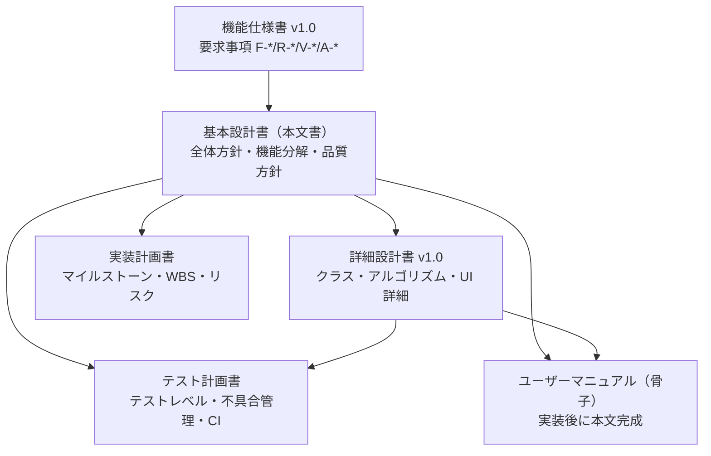
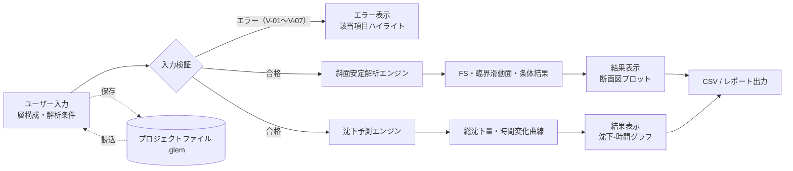

# GLEM（Generalized Limit Equilibrium Method）基本設計書

| 項目 | 内容 |
|---|---|
| 文書名 | GLEM 基本設計書 |
| ソフトウェア名称 | GLEM（Generalized Limit Equilibrium Method） |
| バージョン | 1.0 |
| 作成日 | 2026-08-22 |
| 状態 | 草案 |
| 上位文書 | GLEM 機能仕様書 v1.0（`docs/GLEM_機能仕様書.md`） |
| 下位文書 | GLEM 詳細設計書 v1.0（`docs/GLEM_詳細設計書.md`） |

## 改訂履歴

| バージョン | 日付 | 改訂内容 | 作成者 |
|---|---|---|---|
| 1.0 | 2026-08-22 | 初版発行（機能仕様書 v1.0 準拠） | - |

---

## 1. 概要

### 1.1 目的

本設計書は、GLEM 機能仕様書で定義された要求事項を実現するための**システム全体方針・機能分解・データ管理方針・品質方針**を定める中間層の設計文書である。クラス定義やアルゴリズムの詳細は下位の「詳細設計書」に委ねる。

### 1.2 文書関係

| 文書 | バージョン | 役割 |
|---|---|---|
| GLEM 機能仕様書 | 1.0 | やること（要求）の定義 |
| **GLEM 基本設計書** | 1.0 | どう実現するかの全体方針・分解 |
| GLEM 詳細設計書 | 1.0 | 実装レベルの詳細（クラス・擬似コード・UI） |
| GLEM テスト計画書 | 1.0 | テストの実行計画・品質管理 |
| GLEM ユーザーマニュアル | 1.0（骨子） | エンドユーザー向け操作手順（本文は実装後） |
| GLEM 実装計画書 | 1.0 | マイルストーン・工数・リスク管理 |

### 1.3 用語集

機能仕様書 §1.4 の用語を継承する。本設計書で新たに用いる用語はない（「サブシステム」「品質ゲート」は一般的な意味で使用する）。

---

## 2. 要求事項サマリ（機能仕様書の継承）

### 2.1 機能要件

| ID | 機能群 | サマリ |
|---|---|---|
| F-01 | プロジェクト管理 | `.glem` の新規作成・開く・保存・自動保存復元 |
| F-02 | 地盤モデル定義 | 層構成・物性値・地下水位の入力と検証（V-01〜V-08） |
| F-03 | 斜面安定解析 | Fellenius法・Bishop簡化法・ヤンブ型GLEM近似による FS 算出と臨界滑動面探索 |
| F-04 | 沈下予測・圧密解析 | 即時＋一次圧密＋二次圧縮の総沈下量と時間変化曲線 |
| F-05 | 結果表示 | 断面図・滑動面プロット、沈下-時間グラフ |
| F-06 | 出力機能 | CSVエクスポート（列定義固定）、レポート生成 |

### 2.2 非機能要件（品質目標）

| 分類 | 目標値 | 出典 |
|---|---|---|
| 精度（斜面安定） | 参照値との FS 誤差 ±0.01 以内（A-1） | 機能仕様書 §4.7 |
| 精度（沈下） | 理論解との沈下量誤差 ±2% 以内（A-4） | 機能仕様書 §5.5 |
| 性能（斜面安定探索） | 標準モデルで 60秒以内 | 機能仕様書 §7 |
| 性能（沈下解析） | 期間100年・出力50点で 30秒以内 | 機能仕様書 §7 |
| 性能（起動） | メイン画面表示まで 10秒以内 | 機能仕様書 §7 |
| 保守性 | 計算カーネルのテストカバレッジ 80%以上 | 機能仕様書 §7 |

---

## 3. システム全体方針

### 3.1 運用形態

- Windows 10/11（64bit）上の**デスクトップ単体アプリケーション**。サーバー・ネットワークへの依存はない
- データはローカルのプロジェクトファイル（`.glem`）で管理し、外部データベースを使用しない
- 配布物は自己完結型（ランタイム同梱の単一実行可能ファイルを想定。詳細は詳細設計書 §9）

### 3.2 技術選定方針と理由

| 観点 | 方針 | 理由 |
|---|---|---|
| 実装言語・UI | C# / .NET 8 + WPF | Windows デスクトップ要件へのネイティブ適合、単一ファイル配布の容易性、数値計算をネイティブコードで高速化できる点、MVVM エコシステムの成熟度 |
| 設計パターン | MVVM（View / ViewModel / Model 分離） | UI とロジックの分離による保守性・テスト容易性の確保 |
| プロット | WPF ネイティブ描画ライブラリを採用 | WebView 依存を避け、断面図・時系列グラフを同一技術で実現する（詳細設計書 D-05） |

具体的なライブラリ名・バージョンは詳細設計書 §2.3 で確定している。

### 3.3 モジュール分割原則

1. **UI / 計算 / IO の分離**：解析エンジンは UI フレームワークに依存しない（詳細設計書 D-01）。これにより計算カーネルを単体テストで検証し、カバレッジ80%以上の品質ゲートを適用できる
2. **依存方向の単一性**：UI 層 → コア層へのみ依存を許可する。逆方向の参照は禁止
3. **機能群とサブシステムの対応**：F-01〜F-06 を §4.1 のサブシステムに1対1で割り当て、責務の重複を避ける

---

## 4. 機能分解とデータフロー

### 4.1 機能構成とサブシステム

| サブシステム | 対応機能群 | 概要 |
|---|---|---|
| プロジェクト管理 | F-01 | `.glem` の読み書き、自動保存・復元、バージョン検証 |
| 地盤モデル入力 | F-02 | 層テーブル編集、物性値入力、入力検証（V-01〜V-08） |
| 斜面安定解析 | F-03 | 条体離散化、FS 計算（3手法）、臨界滑動面探索 |
| 沈下予測 | F-04 | 即時/一次圧密/二次圧縮の算出、時間変化曲線生成 |
| 結果表示・出力 | F-05, F-06 | 断面図・グラフ描画、CSV/レポートエクスポート |

### 4.2 データフロー

### 4.3 解析実行方針（ポリシー）

1. 検証エラーがある状態では解析を実行しない（機能仕様書 §3.4）
2. 解析計算は UI スレッドをブロックせず、進捗を可視化する（詳細設計書 D-06）
3. 解析は中断可能であり、中断時は中間結果を表示しない
4. 警告（V-08 等）はユーザー確認後に続行する

---

## 5. データ管理方針

| 項目 | 方針 |
|---|---|
| 唯一のソース | プロジェクトファイル `.glem` を入力・条件・結果コンテキストの単一情報源とする。メモリ上の状態は常に `.glem` に保存可能であること |
| 形式 | JSON テキスト（人間可読・diff 可能）。フィールド名は snake_case（詳細設計書 §3.3） |
| バージョニング | `format_version` を semver で管理し、major=破壊的変更（確認ダイアログ）、minor=既定値付き追加（後方互換）とする（詳細設計書 §3.4） |
| 座標系・単位 | x は水平 [m]、z は地表から下向き正 [m]。内部は SI 単位、表示層で mm/day 等に換算する（詳細設計書 §3.1） |
| 既定値補完 | 省略可能な物性値（Cr, Cs, σpc' 等）は機能仕様書 §3.3 の既定値規則で計算時に補完し、ファイルに書き戻さない（明示保存時のみ記録） |

---

## 6. 画面構成と操作方針

| 項目 | 方針 |
|---|---|
| 画面数・名称 | 機能仕様書 §8.1 の S-1〜S-6 を継承し、変更しない |
| ナビゲーション | メイン画面（S-1）をハブとする。各解析画面は「設定→結果」の2段構成 |
| 操作原則 | いずれの主要機能も3クリック以内に到達できる（機能仕様書 §7）。破壊的操作（層削除・プロジェクト新規作成）は確認ダイアログを表示する |
| バリデーション UX | エラーは該当セルをハイライトし解析実行をブロック、警告は確認後に続行可能とする（詳細設計書 §5.5） |
| 表示の必須要素 | 斜面安定結果は「FS_min＋臨界滑動面プロット」、沈下結果は「S-t 曲線＋内訳」を必ず同時に表示する |

---

## 7. エラー処理方針

1. **分類**：エラー（解析ブロック）／警告（確認後続行）／エンジン例外（計算不能）／IO 例外（ファイル・形式）の4種に分類する
2. **コード体系**：全ユーザー表示メッセージは `GLEM-nnnn` コードと対応付け、ログとマニュアルで一意に参照できる（詳細設計書 §6.2 の GLEM-1xxx/2xxx/3xxx）
3. **メッセージ原則**：ユーザーが次の操作を判断できる内容（どの項目・何が問題・どう直すか）を含む日本語で表示する
4. **最終防御**：未捕捉例外はグローバルハンドラで受け止め、自動保存データからの復元を促す（機能仕様書 R-3.1.4 と連携）

---

## 8. 品質方針

| 項目 | 方針 |
|---|---|
| 精度検証 | A-1〜A-6 の受入基準を満たすことをリリースの必須条件とする。検証ケースは固定フィクスチャとして管理し、参照値の出典を明記する（詳細設計書 §8.3） |
| テスト戦略 | 単体（計算カーネル・IO）／統合（ファイルラウンドトリップ）／システム（画面操作フロー）／受入（A-1〜A-6）の4レベルで実施する。計画の詳細は「テスト計画書」 |
| 品質ゲート | `GLEM.Core` のカバレッジ80%以上を CI で強制する（機能仕様書 §7、詳細設計書 §9） |
| 性能検証 | T-12 を定期実行し、CI 環境では閾値の2倍超過で失敗とする（詳細設計書 §8.2 T-12 の方針を継承） |

---

## 9. リスクと制約

| ID | リスク・制約 | 影響 | 対策 |
|---|---|---|---|
| RISK-01 | ヤンブ型GLEM近似の補正係数 λc は完全なJanbu一般化法ではない（詳細設計書 D-04） | 適用範囲を超えた利用で結果を誤解する | 実装式を固定ケースで回帰し、画面・レポートへ近似警告を表示し、`docs/METHODS.ja.md` に制限を明記する |
| RISK-02 | 検証ケースの参照値（既知解）の入手・確定遅延 | M1 の完了判定が遅れる | 実装計画書で M1 前半に「参照値確定」を独立タスクとして前倒しする |
| RISK-03 | 即時沈下の影響係数 I_f の数値積分（Boussinesq）の検証不足 | 即時沈下項の精度リスク | 既知解（均質半無限空間の解析解）との比較テストを追加する（T-07 に統合） |
| RISK-04 | スコープ外機能の要求混入（FEM・動的解析等） | 工数増 | 機能仕様書 §1.2 の対象外を維持し、変更は実装計画書 §7 の変更管理フローで承認する |

---

## 10. 機能仕様書へのトレースビリティ

| 機能仕様書要求 | 本設計書の対応箇所 |
|---|---|
| F-01〜F-06（§2.3） | §4.1 サブシステム対応表 |
| R-3.1.x（プロジェクト管理） | §5 データ管理方針、§7 エラー処理方針 4 |
| R-3.3.x / V-01〜V-08（地盤モデル・検証） | §4.2 データフロー（検証ゲート）、§6 バリデーションUX方針、§7 分類1 |
| F-03 / A-1, A-2, A-3（斜面安定） | §2.2 精度目標、§8 精度検証、RISK-01/02 |
| F-04 / A-4〜A-6（沈下予測） | §2.2 精度目標、§8 精度検証、RISK-03 |
| F-05, F-06（表示・出力） | §6 表示の必須要素、§4.2 データフロー（OUT） |
| §7 非機能要件（性能・保守性） | §2.2 品質目標、§8 テスト戦略・品質ゲート |
| §8 画面 S-1〜S-6 / 操作フロー | §6 画面構成と操作方針 |
