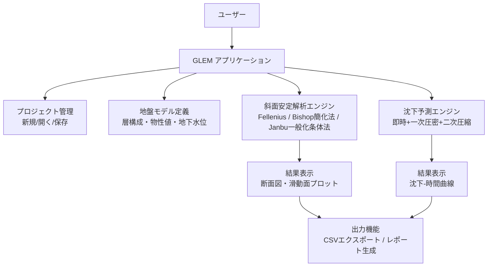

# GLEM（Generalized Limit Equilibrium Method）機能仕様書

| 項目 | 内容 |
|---|---|
| 文書名 | GLEM 機能仕様書 |
| ソフトウェア名称 | GLEM（Generalized Limit Equilibrium Method） |
| バージョン | 1.0 |
| 作成日 | 2026-08-22 |
| 状態 | 草案 |
| 作成者 | （未定） |
| 承認者 | （未定） |

## 改訂履歴

| バージョン | 日付 | 改訂内容 | 作成者 |
|---|---|---|---|
| 1.0 | 2026-08-22 | 初版発行 | - |

---

## 1. 概要

### 1.1 目的

GLEM（Generalized Limit Equilibrium Method）は、地盤工学における**斜面安定解析**と**沈下予測・圧密解析**を行うWindowsデスクトップアプリケーションである。本仕様書は、GLEMの機能要件、入力・出力項目、計算手法、非機能要件、受入基準を定義するものである。

### 1.2 適用範囲

| 区分 | 内容 |
|---|---|
| 対象とする機能 | 斜面安定解析（円すい滑動面法・非円滑動面の一般化条体法）、沈下予測・圧密解析（一次元理論）、地盤モデル入力、結果表示・出力 |
| 対象としない機能 | 二次元・三次元有限要素法解析、動的（地震応答）解析、擁壁・杭の設計計算、地下水定常流場の数値解析（地下水位線は既知条件として与える） |

### 1.3 対象ユーザー

- 斜面設計、盛土設計、地盤沈下評価に従事する地盤工学エンジニア
- 大学・研究機関における教育・検証用途の利用者

### 1.4 用語集

| 用語 | 定義 |
|---|---|
| FS（安全率） | 滑動面沿いの抵抗力と駆動力の比。FS ≥ 1.0 で安定と判定する |
| 条体（slice） | 滑動体を分割した計算単位 |
| c'（有効接着強度） | 有効応力ベースの接着強度 [kPa] |
| φ'（有効摩擦角） | 有効応力ベースの内部摩擦角 [deg] |
| γ（単位重量） | 土の単位重量 [kN/m³] |
| u（間隙水圧） | 条体底中心における間隙水圧 [kPa] |
| ru（間隙水圧比） | u / σ'v0 の比 [-] |
| e0（初期空隙比） | 圧密開始時の空隙比 [-] |
| Cc（圧縮指数） | e-log p 曲線の圧縮分支勾 [-] |
| Cr（再圧縮指数） | e-log p 曲線のリロード分枝勾配 [-] |
| Cs（二次圧縮指数） | 二次圧密の e-log t 直線勾配 [-] |
| σpc'（前期圧力） | 土が過去に受けた最大有効応力 [kPa] |
| k（透水係数） | Darcy則に基づく透水係数 [m/s] |
| cv（圧密係数） | cv = k / (mv・γw) [m²/s] |
| mv（体積圧縮係数） | mv = Cc / ((1+e0)・σ'v・ln10) [1/kPa] |
| U（圧密度） | 一次圧密沈下の進行率 [%] |
| Tv（時間係数） | Tv = cv・t / Hdr² [-] |
| Hdr（排水路長） | 単一排水で層厚H、二重排水で H/2 [m] |

### 1.5 参照資料

- 「斜面安定解析指針」、日本地盤工学会
- JIS A 1203-S「土の圧密試験方法」
- Terzaghi, K., Peck, R.B. & Mesri, G.: *Soil Mechanics in Engineering Practice*, Wiley
- Bishop, A.W. (1955): "The use of the limit equilibrium method in stability analysis of slopes and earth dams"

---

## 2. システム概要

### 2.1 全体構成

GLEMは単一のWindowsデスクトップアプリケーションとして提供される。サーバーや外部サービスへの依存はなく、プロジェクトファイル（`.glem`）の読み書きと解析計算をローカルで完結させる。



### 2.2 利用環境

| 項目 | 要件 |
|---|---|
| OS | Windows 10 / 11（64bit） |
| CPU | x86-64、4コア以上を推奨 |
| メモリ | 最小 4 GB、推奨 8 GB 以上 |
| ストレージ | 空き容量 500 MB 以上 |
| ディスプレイ | 1920×1080 解像度を推奨 |

### 2.3 機能構成

| No. | 機能群 | 内容 |
|---|---|---|
| F-01 | プロジェクト管理 | プロジェクトの新規作成・開く・保存・自動保存 |
| F-02 | 地盤モデル定義 | 層構成・物性値・地下水位の入力と検証 |
| F-03 | 斜面安定解析 | 滑動面探索、安全率計算、臨界滑動面の特定 |
| F-04 | 沈下予測・圧密解析 | 総沈下量、時間変化曲線の算出 |
| F-05 | 結果表示 | 断面図・滑動面プロット、沈下-時間グラフ |
| F-06 | 出力機能 | CSVエクスポート、レポート生成 |

---

## 3. 共通機能

### 3.1 プロジェクトファイル管理（F-01）

| No. | 要求事項 |
|---|---|
| R-3.1.1 | ユーザーは新規プロジェクトを作成できる。作成時は既定値（層なし、解析未設定）で初期化される |
| R-3.1.2 | ユーザーは `.glem` ファイルを開いてプロジェクトを読み込める |
| R-3.1.3 | ユーザーはプロジェクトを保存・名前をつけて保存できる |
| R-3.1.4 | 解析実行中および入力中の状態を5分間隔で自動保存し、異常終了後の起動時に復元を促すダイアログを表示する |
| R-3.1.5 | バージョン不一致の `.glem` ファイルを開いた場合は警告ダイアログを表示し、ユーザーの確認後に読み込むか破棄するかを選択できる |

### 3.2 プロジェクトファイル形式（`.glem`）

`.glem` はJSONベースのテキストファイルである。構造は以下の通り（例）。

```json
{
  "format_version": "1.0",
  "project_name": "例_斜面A",
  "created_at": "2026-08-22T09:00:00+09:00",
  "ground_model": {
    "water_table_depth_m": 5.0,
    "layers": [
      {
        "name": "表層砂質土",
        "thickness_m": 3.0,
        "gamma_kN_m3": 18.0,
        "c_kPa": 0.0,
        "phi_deg": 32.0,
        "k_m_s": 1.0e-4,
        "e0": 0.75,
        "Cc": 0.25,
        "Cr": 0.08,
        "Cs": 0.02,
        "sigma_pc_kPa": null
      }
    ]
  },
  "slope_analysis": {
    "method": "bishop_simplified",
    "slice_width_m": 1.0,
    "surcharge_kPa": 0.0,
    "kh": 0.0,
    "kv": 0.0,
    "search_range": null
  },
  "settlement_analysis": {
    "load_kPa": 100.0,
    "loaded_area_m": [6.0, 6.0],
    "drainage": "single",
    "duration_years": 10.0
  }
}
```

### 3.3 地盤モデル定義（F-02）

| No. | 要求事項 |
|---|---|
| R-3.3.1 | ユーザーは地表から順に層を追加・削除・順序変更できる。層数は1〜50とする |
| R-3.3.2 | 各層の物性値を下表に従い入力できる |
| R-3.3.3 | 地下水位は地表からの深さ [m] で指定する。全層共通の単一水位のみ対応する |
| R-3.3.4 | 層厚の合計が0より大きいことを保証する |

**層物性値入力項目**

| 項目 | 記号 | 単位 | 許容範囲 | 必須 | 備考 |
|---|---|---|---|---|---|
| 層名 | - | - | 32文字以内 | ○ | 重複可 |
| 層厚 | H | m | (0, 1000] | ○ | |
| 単位重量（湿潤） | γ | kN/m³ | [5, 30] | ○ | |
| 有効接着強度 | c' | kPa | [0, 500] | ○ | |
| 有効摩擦角 | φ' | deg | [0, 45] | ○ | |
| 透水係数 | k | m/s | [1e-9, 1e-2] | △ | 沈下解析実行時に必須 |
| 初期空隙比 | e0 | - | [0.2, 3.0] | △ | 沈下解析実行時に必須 |
| 圧縮指数 | Cc | - | (0, 5] | △ | 沈下解析実行時に必須 |
| 再圧縮指数 | Cr | - | [0, 1] | × | 未入力時は 0.3×Cc を採用 |
| 二次圧縮指数 | Cs | - | [0, 0.2] | × | 未入力時は 0（無視）を採用 |
| 前期圧力 | σpc' | kPa | (0, ∞) | × | 未入力時は現行有効応力を採用 |

### 3.4 入力検証とエラー処理

解析実行前に全必須項目を検証する。検証に失敗した場合は解析を実行せず、該当フィールドをハイライトしてメッセージを表示する。

| No. | 検証ルール | 種別 | メッセージ（例） |
|---|---|---|---|
| V-01 | 層が1つ以上存在すること | エラー | 「地盤層が定義されていません」 |
| V-02 | 全層の層厚 > 0 | エラー | 「層「{name}」の層厚は0より大きい値を指定してください」 |
| V-03 | φ' が [0, 45] の範囲内 | エラー | 「有効摩擦角は0〜45度の範囲で指定してください」 |
| V-04 | c', γ が許容範囲内 | エラー | 「「{item}」の値が許容範囲外です（{value}）」 |
| V-05 | 地下水位深さが [0, 全層厚合計] の範囲内 | エラー | 「地下水位は地表から地盤底の間の深さを指定してください」 |
| V-06 | 沈下解析実行時に k, e0, Cc が全層で入力済み | エラー | 「沈下解析には透水係数・初期空隙比・圧縮指数の入力が必須です（層「{name}」）」 |
| V-07 | 載荷荷重 q ≥ 0 | エラー | 「載荷荷重は0以上の値を指定してください」 |
| V-08 | φ' = 0 かつ c' = 0 の層が滑動面に含まれる場合 | 警告 | 「無粘性土（c'=0, φ'=0）の層が含まれています。結果を確認してください」 |

エラーは解析実行をブロックし、警告は確認ダイアログを表示して続行を許可する。

---

## 4. 斜面安定解析機能（F-03）

### 4.1 機能概要

地盤モデルと荷重条件に対し、限界平衡法により滑動面沿いの安全率 FS を算出する。探索範囲内の滑動面を走査し、最小 FS（臨界滑動面）を特定して出力する。

### 4.2 解析手法

| No. | 手法 | 滑動面の形状 | 満たす平衡条件 | 用途 |
|---|---|---|---|---|
| M-1 | Fellenius法（スウェーデン円すい法） | 円弧 | 力の平衡のみ | 簡易チェック、教育用途 |
| M-2 | Bishop簡化法 | 円弧 | 力の平衡＋全体モーメント平衡（条体間水平力のみ考慮） | **既定手法**。一般的な斜面安定評価 |
| M-3 | Janbu一般化条体法 | 非円（任意の関数 y=f(x) で定義） | 力の平衡（条体間力を底面に平行と仮定、補正係数 λc を適用） | 層状地盤・不規則滑動面 |

ユーザーは解析設定画面で手法を選択する。既定値は M-2（Bishop簡化法）とする。

### 4.3 計算式

共通記号：条体 i の重量 W_i [kN/m]、底面の傾き α_i（水平からの角度）、底面長 ΔL_i [m]、底面中心の深さにおける間隙水圧 u_i [kPa]。有効法線力 N'_i = W_i・cosα_i − u_i・ΔL_i とする。

**M-1 Fellenius法**

$$
FS \;=\; \frac{\sum\left(c'\,\Delta L_i\right) + \sum\left(N'_i\,\tan\phi'\right)}{\sum W_i\,\sin\alpha_i}
$$

**M-2 Bishop簡化法（反復計算）**

$$
FS \;=\; \frac{\sum\dfrac{c'\,\Delta L_i + (W_i - u_i\,\Delta L_i)\,\tan\phi'}{m_{\alpha,i}}}{\sum W_i\,\sin\alpha_i}
$$

$$
m_{\alpha,i} \;=\; \cos\alpha_i\left(1 + \frac{\tan\alpha_i\,\tan\phi'}{FS}\right)
$$

初期値 FS=1.0 とし、|ΔFS| < 0.001 となるまで反復する（最大200回）。収束しない場合は警告を表示して最終値を採用する。

**M-3 Janbu一般化条体法（非円滑動面）**

滑動面を y=f(x) で定義し、各点の傾き α_i を f'(x) から求める。条体間力は底面に平行と仮定し、補正係数 λc（円弧では1.0、非円ではJanbuの手順により算出する1以上の値）を適用する。

$$
FS \;=\; \frac{\sum\left(c'\,\Delta L_i + N'_i\,\tan\phi'\right)}{\lambda_c \cdot \sum W_i\,\sin\alpha_i}
$$

**間隙水圧の算出**

- 地下水位線より上：u = 0（無圧水）
- 地下水位線より下：静水圧 u = γw・(水位からの深さ) を採用
- 層ごとに ru 比を指定する場合は、その深度の有効応力 σ'v0 に対して u = ru・σ'v0 とする（両方指定時は ru 優先）

**擬静力学係数**

kh, kv を指定した場合、条体重量に W_i・(1+kv) を乗じ、水平方向の駆動力に W_i・kh を加算して計算する。既定値は kh = kv = 0。

### 4.4 臨界滑動面の探索

| No. | 要求事項 |
|---|---|
| R-4.4.1 | 円すい滑動面（M-1, M-2）：中心座標 (x, y) と半径 R の3次元空間を、粗グリッド走査→局所最適化の2段階で探索する |
| R-4.4.2 | 非円滑動面（M-3）：ユーザーが制御点または関数パラメータで滑動面形状を定義し、その形状族内で条体分割のみを変えて FS を算出する。複数の候補形状を登録して比較できる |
| R-4.4.3 | 探索範囲はユーザー指定可能。未指定時は斜面幾何から自動決定する（中心：滑り出し部を中心に上下 ±2×斜面高、半径：0.5〜3×斜面高） |

**探索パラメータ既定値**

| パラメータ | 既定値 | 許容範囲 |
|---|---|---|
| 条体幅 | 1.0 m | [0.5, 2.0] m |
| FS収束許差 | 0.001 | - |
| 最大反復回数 | 200回 | - |
| 粗グリッド間隔 | 2.0 m | [1.0, 5.0] m |
| 局所探索ステップ | 0.5 m | [0.2, 1.0] m |

### 4.5 入力項目

| 項目 | 単位 | 必須 | 既定値 | 備考 |
|---|---|---|---|---|
| 解析手法 | - | ○ | Bishop簡化法 | M-1 / M-2 / M-3 から選択 |
| 条体幅 | m | × | 1.0 | §4.4 の範囲内 |
| 載荷荷重 q | kPa | × | 0 | 斜面冠上の一様載荷 |
| 載荷位置・範囲 | m | △ | - | q > 0 の場合、x座標範囲を指定 |
| 擬静力学係数 kh, kv | - | × | 0.0 | [0, 0.3] を推奨 |
| 探索範囲 | m | × | 自動 | §4.4.3 |

### 4.6 出力項目

| No. | 出力内容 | 形式 |
|---|---|---|
| O-1 | 最小安全率 FS_min | 数値（小数第3位まで表示） |
| O-2 | 臨界滑動面の定義（円弧：中心座標・半径／非円：制御点列） | 数値＋断面図上プロット |
| O-3 | 条体別結果表 | テーブル（§6.3 のCSV列と同一） |
| O-4 | 探索グリッド上の FS 分布 | グラフ（任意表示） |

### 4.7 受入基準

| No. | 基準 |
|---|---|
| A-1 | 標準検証ケース（§9 T-01〜T-03）において、手算・参考文献値との FS の誤差が ±0.01 以内であること |
| A-2 | 全テストモデルで最大反復回数以内に収束し、収発散の警告のみで計算を完了できること |
| A-3 | ru = 0 と静水圧条件の両方で正しく FS が変化すること（水位上昇で FS は低下する） |

---

## 5. 沈下予測・圧密解析機能（F-04）

### 5.1 機能概要

載荷位置直下の指定点において、一次元圧密理論に基づき総沈下量と時間変化曲線を算出する。

$$
S_{total} \;=\; S_{immediate} + S_{primary} + S_{secondary}
$$

### 5.2 計算式

**即時沈下（弾性）**

$$
S_{immediate} \;=\; \frac{q\,B}{E_s}\cdot I_f
$$

ここで B は載荷面積の代表寸法 [m]、Es は地盤の弾性係数 [kPa]（層物性値として入力）、I_f は L/B と埋設深さに依存する影響係数である。Es 未入力の層は即時沈下から除外し警告を表示する。

**一次圧密沈下**

層 j について、載荷後の有効応力 σ'f = σ'i + Δσ とする。

- σ'f ≤ σpc' の場合：$\Delta e_j = C_r \cdot \log\dfrac{\sigma'f}{\sigma'i}$
- σ'f > σpc' の場合：$\Delta e_j = C_r \cdot \log\dfrac{\sigma'c'}{\sigma'i} + C_c \cdot \log\dfrac{\sigma'f}{\sigma'c'}$

$$
S_{primary} \;=\; \sum_j \frac{H_j}{1+e_{0,j}}\,\Delta e_j
$$

**二次圧縮（一次圧密完了時刻 tc 以降）**

$$
\Delta e_{s,j} = C_s \cdot \log\frac{t}{t_c}, \qquad S_{secondary} = \sum_j \frac{H_j}{1+e_{0,j}}\,\Delta e_{s,j}
$$

**時間変化（圧密度）**

$$
T_v \;=\; \frac{c_v\, t}{H_{dr}^2}, \qquad c_v = \frac{k}{m_v\,\gamma_w}, \qquad m_v = \frac{C_c}{(1+e_0)\,\sigma'v\cdot\ln 10}
$$

圧密度 U と Tv の関係は以下の近似式で求める。

- $T_v < 0.2$：$\;U \approx \dfrac{2}{\sqrt{\pi}}\sqrt{T_v}$（厳密解の小Tv漸近の主項）
- $T_v \geq 0.2$：$\;U \approx 1 - \dfrac{8}{\pi^2}\,e^{-\pi^2 T_v/4}$（厳密級数の主項。Tv=0.2 で小Tv式と連続、Tv≥0.2 では誤差<2%）

各時刻の沈下量は $S(t) = S_{immediate} + U(t)\cdot S_{primary} + S_{secondary}(t)$ とする。排水路長 Hdr は単一排水で層厚 H、二重排水で H/2 を採用し、ユーザーが選択できる（既定：単一排水）。

### 5.3 入力項目

| 項目 | 単位 | 必須 | 既定値 | 備考 |
|---|---|---|---|---|
| 載荷荷重 q | kPa | ○ | - | 一様載荷 |
| 載荷面積 B×L | m² | × | 6.0×6.0 | 即時沈下の影響係数に使用 |
| 弾性係数 Es（層別） | kPa | △ | - | 未入力層は即時沈下から除外 |
| 排水条件 | - | × | 単一排水 | 単一 / 二重 |
| 解析期間 | year | × | 10 | [0.1, 100] |
| 出力間隔 | day | × | 自動（50点） | 対数等間隔で分割 |

### 5.4 出力項目

| No. | 出力内容 | 形式 |
|---|---|---|
| O-1 | 総沈下量 S_total [mm] | 数値 |
| O-2 | 即時 / 一次圧密 / 二次圧縮の内訳 [mm] | テーブル |
| O-3 | 沈下-時間曲線（t, U, S の時系列） | グラフ＋テーブル |
| O-4 | U=50%、U=90% に到達する時刻 | 数値 |

### 5.5 受入基準

| No. | 基準 |
|---|---|
| A-4 | 単一層の圧密問題について、理論解（厳密解または既知の数値解）との沈下量誤差が ±2% 以内であること |
| A-5 | U-Tv 関係が §5.2 の近似式と一致し、Tv=0.197 で U≈50% となること（±1%） |
| A-6 | 二重排水の選択で到達時刻が約1/4に短縮されること |

---

## 6. 結果表示・出力機能（F-05, F-06）

### 6.1 断面図・滑動面プロット

| No. | 要求事項 |
|---|---|
| R-6.1.1 | 地盤断面（層境界、地下水位線）、臨界滑動面、条体分割線を同一画面に表示する |
| R-6.1.2 | ズーム・パン操作に対応し、FS_min と滑動面の深さ・半径を注記表示する |
| R-6.1.3 | 非円滑動面（M-3）の場合も同様にプロットする |

### 6.2 沈下-時間グラフ

| No. | 要求事項 |
|---|---|
| R-6.2.1 | S-t 曲線と内訳（即時＋一次圧密＋二次圧縮の積み上げ）を表示する |
| R-6.2.2 | 横軸を対数スケールに切り替えられる |
| R-6.2.3 | カーソル操作で任意時刻の t, U, S を読み取れる |

### 6.3 データエクスポート（CSV）

UTF-8、カンマ区切り。ヘッダ行を含む。

**斜面安定解析結果（条体別）**

| 列名 | 内容 | 単位 |
|---|---|---|
| slice_no | 条体番号 | - |
| x_m / z_m | 底面中心座標 | m |
| W_kN_per_m | 条体重量 | kN/m |
| alpha_deg | 底面傾き | deg |
| u_kPa | 間隙水圧 | kPa |
| Np_kN_per_m | 有効法線力 | kN/m |
| c_term_kN_per_m | 接着項 c'ΔL（Bishop簡化法では m_α 除算後） | kN/m |
| phi_term_kN_per_m | 摩擦項 N'tanφ'（同上） | kN/m |

**沈下解析結果（時系列）**

| 列名 | 内容 | 単位 |
|---|---|---|
| time_days | 時刻 | day |
| U_percent | 圧密度 | % |
| settlement_mm | 累積沈下量 | mm |

### 6.4 レポート生成

現在のプロジェクトの入力概要・解析結果・図面を1つのレポート（HTMLまたはPDF）として出力する。レポートには文書ヘッダのバージョン情報と生成日時を含める。

---

## 7. 非機能要件

| 分類 | 要求事項 | 指標 |
|---|---|---|
| 精度 | 斜面安定解析の FS が参照値と一致する | §4.7 A-1（±0.01） |
| 精度 | 沈下量が理論解と一致する | §5.5 A-4（±2%） |
| 性能 | 標準モデル（層数≤15、斜面高≤50 m）の臨界滑動面探索が完了する | 60秒以内 |
| 性能 | 沈下解析（期間100年、出力50点）が完了する | 30秒以内 |
| 性能 | アプリ起動からメイン画面表示まで | 10秒以内 |
| 使いやすさ | いずれの主要機能も3クリック以内に到達できる | - |
| 使いやすさ | 全入力項目に単位とツールチップを表示する | - |
| 信頼性 | 異常終了時のデータ喪失を防ぐ | §3.1 R-3.1.4 の自動保存・復元 |
| 信頼性 | 検証エラー時に解析を実行しない | §3.4 |
| 保守性 | 解析エンジンをUIから分離したモジュール構成とする | - |
| 保守性 | 計算カーネルのユニットテストカバレッジ | 80%以上 |

---

## 8. 画面構成と操作フロー

### 8.1 画面一覧

| No. | 画面名 | 主な内容 |
|---|---|---|
| S-1 | メイン画面 | プロジェクト操作（新規/開く/保存）、機能メニュー、ステータスバー |
| S-2 | 地盤モデル入力画面 | 層テーブルエディタ、物性値入力、地下水位設定、検証結果表示 |
| S-3 | 斜面安定解析設定画面 | 手法選択、探索パラメータ、載荷・地震係数入力 |
| S-4 | 斜面安定解析結果画面 | §6.1 の断面図プロット、FS_min、条体別テーブル |
| S-5 | 沈下解析設定画面 | §5.3 の入力項目 |
| S-6 | 沈下解析結果画面 | §6.2 のグラフ、内訳テーブル |

### 8.2 基本操作フロー

1. メイン画面から新規プロジェクトを作成する（S-1）
2. 地盤層と物性値を入力し、検証を通過させる（S-2）
3. 解析種別を選択する（斜面安定 / 沈下予測）
4. 解析条件を設定して実行する（S-3 または S-5）
5. 結果を確認する（S-4 または S-6）
6. CSVエクスポートまたはレポート生成を行う

---

## 9. 受入基準・テスト項目

| ID | テスト項目 | 入力条件（要約） | 期待される結果 | 合格判定 |
|---|---|---|---|---|
| T-01 | Fellenius法検証 | 均質地盤の標準斜面、手算例 | FS が参考文献値と一致 | §4.7 A-1 |
| T-02 | Bishop簡化法検証 | 同上（手法のみ変更） | FS が参考文献値と一致 | §4.7 A-1 |
| T-03 | Janbu一般化条体法検証 | 非円滑動面の既知ケース | FS が参考文献値と一致 | §4.7 A-1 |
| T-04 | 間隙水圧の影響 | ru=0 と ru=0.5 の比較 | 水位上昇で FS が低下する | §4.7 A-3 |
| T-05 | 擬静力学係数の影響 | kh=0 と kh=0.1 の比較 | kh 増大で FS が低下する | 単調減少 |
| T-06 | U-Tv 関係の検証 | 単一層、既知 cv | Tv=0.197 で U≈50% | §5.5 A-5 |
| T-07 | 多層地盤沈下の検証 | 手算可能な2層モデル | S_total が理論値と一致 | §5.5 A-4 |
| T-08 | 排水条件の影響 | 単一 / 二重排水の比較 | U=90% 到達時刻が約1/4 | §5.5 A-6 |
| T-09 | 入力検証 | §3.4 の各ルール違反を入力 | 該当メッセージ表示、解析ブロック | V-01〜V-08 全項目 |
| T-10 | CSVエクスポート | 任意の解析結果を出力 | §6.3 の列構成・値が一致 | 列数・単位・桁数 |
| T-11 | プロジェクト保存/復元 | 入力→保存→再読込 | 全項目が同一に復元される | diff 0件 |
| T-12 | 性能テスト | §7 の標準モデル | 解析時間上限以内 | §7 性能指標 |
