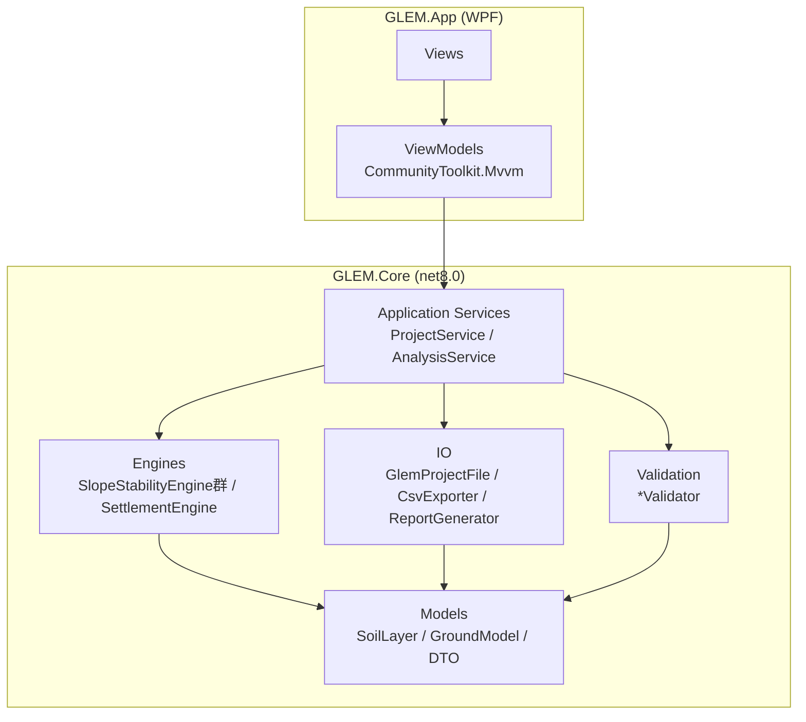
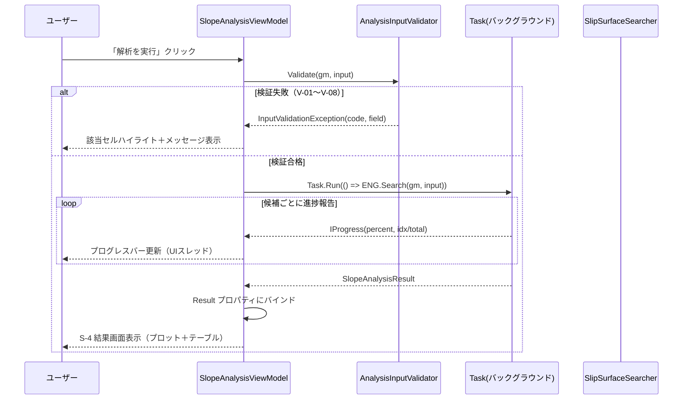

# GLEM（Generalized Limit Equilibrium Method）詳細設計書

| 項目 | 内容 |
|---|---|
| 文書名 | GLEM 詳細設計書 |
| ソフトウェア名称 | GLEM（Generalized Limit Equilibrium Method） |
| バージョン | 1.0 |
| 作成日 | 2026-08-22 |
| 状態 | 草案 |
| 上位文書 | GLEM 機能仕様書 v1.0（`docs/GLEM_機能仕様書.md`） |
| 実装技術 | C# / .NET 8 + WPF |

## 改訂履歴

| バージョン | 日付 | 改訂内容 | 作成者 |
|---|---|---|---|
| 1.0 | 2026-08-22 | 初版発行（機能仕様書 v1.0 準拠） | - |

---

## 1. 概要

### 1.1 目的

本設計書は、GLEM 機能仕様書 v1.0 で定義された要求事項（F-01〜F-06、R-*、V-*、A-*、T-*）を実現するための詳細設計を定める。モジュール構成、データ構造、アルゴリズム（擬似コード）、UI 設計、エラー処理、テスト設計を含む。

### 1.2 機能仕様書との関係

本設計書の各章は §10 のトレースビリティ行列で機能仕様書の要求 ID と対応付けられる。機能仕様の改訂時は本設計書の該当節と §10 を同期更新する。

### 1.3 用語集（設計用語）

| 用語 | 定義 |
|---|---|
| エンジン | 解析計算を行う `GLEM.Core` 内のクラス群（UI 非依存） |
| ViewModel | WPF/MVVM のバインディング層クラス |
| スライス / 条体 | 滑動体を分割した計算単位（機能仕様書 §1.4 と同一） |
| 候補面 | 探索対象の滑動面（円弧または非円関数） |

### 1.4 設計判断一覧

| ID | 判断内容 | 理由 |
|---|---|---|
| D-01 | UI（`GLEM.App`）と計算（`GLEM.Core`）を別プロジェクトに分離 | 機能仕様書 §7「解析エンジンをUIから分離したモジュール構成」の要求。計算カーネルの単体テスト容易性（カバレッジ80%以上） |
| D-02 | `.glem` は JSON テキスト形式 | 機能仕様書 §3.2 の規定。人間可読・diff 可能・System.Text.Json でネイティブ対応 |
| D-03 | 多層地盤の圧密時間変化は「層別 U(t) の重ね合わせ」近似を採用 | 各層が同一載荷 Δσ を受け、独立に圧密するとして S(t)=S_imm+Σ S_j・U_j(t)+S_sec とする。簡易設計法として実務で広く用いられる手法であり、機能仕様書 §5.2 の式と整合 |
| D-04 | Janbu 法の補正係数 λc は公開の閉形式補正式（条体底面角の加重平均偏差）で算出 | 円弧では1.0、非円は `λc = 1 + Σ(Wi·sinαi·|αi−ᾱ|)/Σ(Wi·sinαi)`（Janbu 1964 の補正を Das「Advanced Soil Mechanics」の表現で実装、上限2.0）。テーブル補間より離散誤差がなく、T-03d/T-03e で公開式に基づく参照値2件と照合して検証する（機能仕様書 §4.7 A-1） |
| D-05 | プロットは ScottPlot を採用 | WPF ネイティブ描画で WebView 依存がなく、断面図・時系列グラフの両方に適用可能 |
| D-06 | 解析計算はバックグラウンド `Task` で実行し `IProgress<T>` で進捗報告 | UI フリーズ防止（機能仕様書 §7 性能・使いやすさ要求） |

---

## 2. システムアーキテクチャ設計

### 2.1 ソリューション構成

```
GLEM.sln
├── src/
│   ├── GLEM.App/                  WPF アプリケーション（net8.0-windows）
│   │   ├── App.xaml / App.xaml.cs
│   │   ├── Views/                 画面（§5 の S-1〜S-6 に対応）
│   │   │   ├── MainWindow.xaml
│   │   │   ├── GroundModelEditorView.xaml
│   │   │   ├── SlopeAnalysisSettingsView.xaml
│   │   │   ├── SlopeResultView.xaml
│   │   │   ├── SettlementSettingsView.xaml
│   │   │   └── SettlementResultView.xaml
│   │   ├── ViewModels/
│   │   │   ├── MainViewModel.cs
│   │   │   ├── GroundModelEditorViewModel.cs
│   │   │   ├── SlopeAnalysisViewModel.cs
│   │   │   └── SettlementViewModel.cs
│   │   └── Converters/            バインディング用コンバータ
│   └── GLEM.Core/                 ドメインモデル＋解析エンジン（net8.0）
│       ├── Models/                SoilLayer, GroundModel, 入出力 DTO
│       ├── Engines/               ISlopeStabilityEngine 実装群, SettlementEngine
│       ├── IO/                    GlemProjectFile, CsvExporter, ReportGenerator
│       └── Validation/            GroundModelValidator, AnalysisInputValidator
└── tests/
    └── GLEM.Tests/                xUnit テストプロジェクト＋ fixtures/*.glem
```

### 2.2 レイヤー構成と依存関係



依存は上から下へのみ許可する（`GLEM.App → GLEM.Core`）。`GLEM.Core` は WPF 参照を禁止し、UI 非依存を保証する。

### 2.3 技術選定

| 用途 | 採用 | 根拠 |
|---|---|---|
| ランタイム | .NET 8 (LTS) | 機能仕様書 §2.2 の Windows 10/11 対応、長期サポート |
| UI フレームワーク | WPF（net8.0-windows） | デスクトップアプリ要件、DataGrid・プロット統合が容易 |
| MVVM | CommunityToolkit.Mvvm | ソースジェネレータによるコマンド/プロパティ簡素化 |
| プロット | ScottPlot 5.x | D-05 |
| シリアライズ | System.Text.Json（SnakeCaseLower） | D-02、.NET 標準 |
| ログ | Microsoft.Extensions.Logging + FileProvider | §7 |
| テスト | xUnit + FluentAssertions | §8、機能仕様書 §7 保守性要求 |

### 2.4 モジュール責務と機能仕様の対応

| モジュール | 責務 | 機能仕様書対応 |
|---|---|---|
| `GlemProjectFile` | `.glem` の読み書き・バージョン検証（R-3.1.5） | F-01, R-3.1.x |
| `GroundModelValidator` / `AnalysisInputValidator` | 入力検証 V-01〜V-08、既定値補完 | §3.4 |
| `SlopeStabilityEngine`（Fellenius/Bishop/Janbu） | FS 計算・収束判定 | F-03, §4.2〜§4.3 |
| `SlipSurfaceSearcher` | 臨界滑動面探索（粗グリッド→局所最適化） | §4.4 |
| `SettlementEngine` | 沈下量・時間変化曲線算出 | F-04, §5.2 |
| `CsvExporter` / `ReportGenerator` | CSV・レポート出力 | F-06, §6.3〜§6.4 |
| Views/ViewModels | 画面表示・操作・検証 UX | F-05, §8 |

---

## 3. データ設計

### 3.1 座標系と単位規約

| 項目 | 規約 |
|---|---|
| 水平座標 x | [m]、右向き正。原点はプロジェクトごとに定義（既定：モデル左端） |
| 鉛直座標 z | [m]、**地表から下向き正**。地表は z=0 |
| 内部単位 | SI（m, kPa, s）。表示層で mm・day 等に換算する |
| 浮動小数点 | `double`（IEEE 754 binary64） |
| 定数 | γw = 9.81 [kN/m³]、ln10 = 2.302585093 |

### 3.2 ドメインモデル（C# クラス定義）

**SoilLayer**（`GLEM.Core.Models.SoilLayer`）

| プロパティ | 型 | 単位 | 制約 | 既定値 | 備考 |
|---|---|---|---|---|---|
| Name | string | - | ≤32文字、必須 | "" | |
| ThicknessM | double | m | (0, 1000]、必須 | - | |
| GammaKnm3 | double | kN/m³ | [5, 30]、必須 | - | 湿潤単位重量 |
| CohesionKpa | double | kPa | [0, 500]、必須 | - | c' |
| FrictionAngleDeg | double | deg | [0, 45]、必須 | - | φ' |
| PermeabilityMs | double? | m/s | [1e-9, 1e-2] | null | 沈下解析時に必須（V-06） |
| InitialVoidRatio | double? | - | [0.2, 3.0] | null | e0、同上 |
| CompressionIndexCc | double? | - | (0, 5] | null | 同上 |
| RecompressionIndexCr | double? | - | [0, 1] | 0.3×Cc（補完） | |
| SecondaryCompressionIndexCs | double? | - | [0, 0.2] | 0（補完） | |
| PreconsolidationPressureKpa | double? | kPa | (0, ∞) | 現行有効応力（計算時補完） | σpc' |
| ElasticModulusKpa | double? | kPa | (0, ∞) | null | Es。未設定層は即時沈下から除外し警告 |
| PoissonRatio | double? | - | [0, 0.49] | 0.3（補完） | ν |
| RuRatio | double? | - | [0, 1) | null | 設定時、当該層内の u は ru・σ'v0(depth) を優先採用（機能仕様書 §4.3） |

**GroundModel**

| プロパティ | 型 | 制約 |
|---|---|---|
| Layers | List\<SoilLayer\> | 1〜50 件（V-01, R-3.3.1） |
| WaterTableDepthM | double | [0, TotalThicknessM]（V-05） |
| TotalThicknessM（計算プロパティ） | double | Σ Layers[i].ThicknessM |

**SlopeAnalysisInput**

| プロパティ | 型 | 制約 | 既定値 |
|---|---|---|---|
| Method | enum `SlopeMethod { Fellenius, BishopSimplified, JanbuGeneralized }` | - | BishopSimplified |
| SliceWidthM | double | [0.5, 2.0] | 1.0 |
| SurchargeKpa | double | ≥0（V-07） | 0.0 |
| SurchargeStartX / SurchargeEndX | double? | Start < End、モデル範囲内 | null（全幅適用） |
| Kh / Kv | double | [0, 0.3] | 0.0 |
| SearchRange | `SearchRange?` | §4.5 の自動範囲を上書き | null（自動） |
| ConvergenceTolerance | double | (0, 1) | 0.001 |
| MaxIterations | int | [10, 1000] | 200 |
| CoarseGridStepM | double | [1.0, 5.0] | 2.0 |
| LocalStepM | double | [0.2, 1.0] | 0.5 |

**SlopeAnalysisResult / SliceResult / CriticalSurface**

```csharp
public sealed record SlopeAnalysisResult(
    double MinFs,
    SlopeMethod Method,
    CriticalSurface CriticalSurface,
    IReadOnlyList<SliceResult> Slices,
    bool Converged,
    int Iterations);

public abstract record CriticalSurface;
public sealed record CircleSurface(double CenterX, double CenterZ, double Radius) : CriticalSurface;
public sealed record FunctionSurface(IReadOnlyList<(double X, double Z)> ControlPoints) : CriticalSurface;

public sealed record SliceResult(
    int SliceNo,
    double X,            // 底面中心 x [m]
    double Z,            // 底面中心 z [m]（地表から下向き正）
    double WKnPerM,      // 条体重量 [kN/m]
    double AlphaDeg,     // 底面傾き（水平から）[deg]
    double UKpa,         // 間隙水圧 [kPa]
    double NpKnPerM,     // 有効法線力 [kN/m]
    double CTermKnPerM,  // 接着項（Bishop簡化法では m_α 除算後）[kN/m]
    double PhiTermKnPerM); // 摩擦項（同上）[kN/m]
```

**SettlementAnalysisInput / SettlementAnalysisResult**

| プロパティ | 型 | 制約 | 既定値 |
|---|---|---|---|
| LoadKpa | double | >0、必須 | - |
| LoadedAreaB / LoadedAreaL | double | (0, 1000] | 6.0 / 6.0 |
| Drainage | enum `Drainage { Single, Double }` | - | Single |
| DurationYears | double | [0.1, 100] | 10.0 |
| OutputPointCount | int | [10, 500] | 50（対数等間隔） |

```csharp
public sealed record SettlementAnalysisResult(
    double TotalMm,
    double ImmediateMm,
    double PrimaryMm,
    double SecondaryMm,
    IReadOnlyList<SettlementTimePoint> TimeSeries,
    double? T50Days,   // U=50% 到達時刻（未到達なら null）
    double? T90Days);

public sealed record SettlementTimePoint(double TimeDays, double UPercent, double SettlementMm);
```

### 3.3 `.glem` ファイル形式仕様

JSON オブジェクト1つをルートとする。シリアライズは System.Text.Json、`PropertyNamingPolicy = SnakeCaseLower`、UTF-8（BOM なし）。

**ルートフィールド**

| フィールド | 型 | 必須 | 既定値 | 説明 |
|---|---|---|---|---|
| format_version | string (semver) | ○ | "1.0" | §3.4 の互換ポリシーに従い検証 |
| project_name | string | ○ | "" | ≤64文字 |
| created_at / updated_at | string (ISO 8601) | ○/× | - | UTC+9 表記 |
| ground_model | object | ○ | - | 下表 |
| slope_analysis | object? | × | null | 下表 |
| settlement_analysis | object? | × | null | 下表 |

**ground_model**

| フィールド | 型 | 必須 | 既定値 | 説明 |
|---|---|---|---|---|
| water_table_depth_m | number | ○ | - | [0, 全層厚合計]（V-05） |
| layers | array\<object\> | ○ | - | 1〜50 件、地表から順 |

**ground_model.layers[]**

| フィールド | 型 | 必須 | 既定値 | 説明 |
|---|---|---|---|---|
| name | string | ○ | "" | ≤32文字 |
| thickness_m | number | ○ | - | (0, 1000]（V-02） |
| gamma_kn_m3 | number | ○ | - | [5, 30]（V-04） |
| c_kpa | number | ○ | - | [0, 500]（V-04） |
| phi_deg | number | ○ | - | [0, 45]（V-03） |
| k_m_s | number? | × | null | [1e-9, 1e-2]、沈下解析時に必須（V-06） |
| e0 | number? | × | null | [0.2, 3.0]、同上 |
| cc | number? | × | null | (0, 5]、同上 |
| cr | number? | × | 0.3×cc | [0, 1] |
| cs | number? | × | 0 | [0, 0.2] |
| sigma_pc_kpa | number? | × | null（=現行有効応力） | (0, ∞) |
| es_kpa | number? | × | null | (0, ∞)、即時沈用に使用 |
| poisson_ratio | number? | × | 0.3 | [0, 0.49] |
| ru_ratio | number? | × | null | [0, 1)、斜面安定解析の u 算出に優先適用 |

**slope_analysis**

| フィールド | 型 | 必須 | 既定値 | 説明 |
|---|---|---|---|---|
| method | string | ○ | "bishop_simplified" | "fellenius" / "bishop_simplified" / "janbu_generalized" |
| slice_width_m | number | × | 1.0 | [0.5, 2.0] |
| surcharge_kpa | number | × | 0.0 | ≥0（V-07） |
| surcharge_start_x / surcharge_end_x | number? | × | null | SurchargeKpa>0 で指定可 |
| kh / kv | number | × | 0.0 | [0, 0.3] |
| search_range | object? | × | null（自動） | `{center_x_min, center_x_max, center_z_min, center_z_max, radius_min, radius_max}` |

**settlement_analysis**

| フィールド | 型 | 必須 | 既定値 | 説明 |
|---|---|---|---|---|
| load_kpa | number | ○ | - | >0（V-07） |
| loaded_area_m | [number, number] | × | [6.0, 6.0] | B×L、(0,1000]² |
| drainage | string | × | "single" | "single" / "double" |
| duration_years | number | × | 10.0 | [0.1, 100] |
| output_point_count | int | × | 50 | [10, 500]、対数等間隔 |

### 3.4 `format_version` 互換ポリシー

| 変更種別 | バージョン操作 | 読み込み挙動 |
|---|---|---|
| 破壊的変更（フィールド削除・意味変更） | major 増（1.x → 2.0） | 未対応 major は R-3.1.5 の警告ダイアログで確認後、破棄または読込 |
| フィールド追加（既定値あり） | minor 増（1.0 → 1.1） | 旧ファイルは既定値補完して読込可能（後方互換） |
| バグ修正のみ | patch 増 | 挙動変更なし |

未認識フィールドは警告ログを出力し無視する（前方互換）。

---

## 4. 解析エンジン設計

### 4.1 インターフェース定義

```csharp
public interface ISlopeStabilityEngine
{
    SlopeMethod Method { get; }
    double ComputeFs(IReadOnlyList<SliceGeometry> slices, GroundModel gm);
}

// 条体幾何（解析共通）
public sealed record SliceGeometry(
    int No,
    double XMid,      // 底面中心 x [m]
    double ZMid,      // 底面中心 z [m]
    double DeltaL,    // 底面長 [m]
    double AlphaRad,  // 底面傾き（水平から、上向き正）[rad]
    double WKnPerM);  // 条体重量 [kN/m]

public sealed class SlipSurfaceSearcher
{
    public SlopeAnalysisResult Search(
        GroundModel gm,
        SlopeAnalysisInput input,
        IProgress<SearchProgress>? progress = null,
        CancellationToken ct = default);
}
```

### 4.2 共通計算ルーチン

**有効応力・間隙水圧の算出**（層内の水位線交差を区間分割して積分）

```csharp
// 深度 z [m] における有効垂直応力 σ'v0 [kPa] と間隙水圧 u [kPa]
(double SigmaV0, double U) StressAtDepth(GroundModel gm, double z):
    sigma = 0.0; top = 0.0
    for L in gm.Layers:
        bottom = top + L.ThicknessM
        if z <= bottom:
            (segSigma, _) = LayerEffectiveStress(L, top, z, gm.WaterTableDepthM)
            return (sigma + segSigma, PorePressureAt(gm, L, z))
        sigma += LayerEffectiveStress(L, top, bottom, gm.WaterTableDepthM).Sigma
        top = bottom
    throw GlemException(GLEM-2001)   // 地盤底より深い深度が指定された

// 層区間 [zTop, zBottom] の有効応力増分（水位線で分割して積分）
double LayerEffectiveStress(SoilLayer L, double zTop, double zBottom, double wt):
    sigma = 0.0
    for (a, b) in SplitAt(zTop, zBottom, wt):      // wt が区間内にあれば2分割、なければ1区間
        gammaEff = (a >= wt) ? L.GammaKnm3 - GAMMA_W : L.GammaKnm3
        sigma += gammaEff * (b - a)
    return sigma

// 深度 z の間隙水圧。層に RuRatio が設定されていれば優先採用（機能仕様書 §4.3）
double PorePressureAt(GroundModel gm, SoilLayer L, double z):
    if L.RuRatio != null:
        (sigmaV0, _) = StressAtDepth(gm, z)
        return L.RuRatio * sigmaV0
    return max(0.0, z - gm.WaterTableDepthM) * GAMMA_W
```

**条体離散化（円弧）**

```csharp
// 円弧 (cx, cz, R) を条体幅 sliceWidth で分割。z は地表から下向き正。
List<SliceGeometry> DiscretizeCircle(double cx, double cz, double R, GroundModel gm, double sliceWidth):
    // θ: 中心を通る鉛直線からの角度（時計回り正）。P(θ) = (cx + R·sinθ, cz + R·cosθ)
    // 円弧では底面傾き α = θ（半径と接線の関係より）
    thetaRange = ValidThetaRange(cx, cz, R, gm)   // z ≥ 0 かつモデル水平範囲内の区間
    arcLength = R * (thetaMax - thetaMin)
    n = max(1, ceil(arcLength / sliceWidth))
    slices = []
    for i in 0 .. n-1:
        t0 = thetaMin + i/n * dTheta; t1 = t0 + dTheta
        tm = (t0 + t1) / 2
        xMid = cx + R*sin(tm); zMid = cz + R*cos(tm)
        hL = SurfaceDepthAt(gm, x(t0)) - zBase(x(t0))   // 境界での条体高さ
        hR = SurfaceDepthAt(gm, x(t1)) - zBase(x(t1))
        hAvg = (hL + hR) / 2                              // 平均高さによる重量近似（標準的簡易法）
        if hAvg <= 0: continue                            // 地盤外の条体は除外
        gamma = UnitWeightAt(gm, zMid)                     // 中心深度の単位重量
        W = gamma * (R*dTheta) * hAvg                      // [kN/m]（1m 幅当たり）
        slices.Add(new SliceGeometry(i+1, xMid, zMid, R*dTheta, tm, W))
    if slices.Count < 3: throw GlemException(GLEM-2002)   // 有効条体が不足
    return slices
```

**載荷荷重の適用**：`SurchargeKpa > 0` の場合、載荷範囲内の条体重量に `W += q・ΔL` を加算する（擬静力学係数と併用時は §4.6 の式に従う）。

### 4.3 Fellenius法エンジン

```csharp
double ComputeFs(IReadOnlyList<SliceGeometry> slices, GroundModel gm):
    resisting = 0.0; driving = 0.0
    for s in slices:
        L = LayerAt(gm, s.ZMid)
        u = PorePressureAt(gm, L, s.ZMid)
        Np = max(0.0, s.WKnPerM * cos(s.AlphaRad) - u * s.DeltaL)   // 有効法線力（N'<0 は0扱い）
        resisting += L.CohesionKpa * s.DeltaL + Np * tan(L.FrictionAngleDeg.ToRad())
        driving   += s.WKnPerM * sin(s.AlphaRad)
    if driving <= 0: throw GlemException(GLEM-2003)   // 駆動力がゼロ（滑動面形状不適切）
    return resisting / driving
```

### 4.4 Bishop簡化法エンジン

```csharp
double ComputeFs(IReadOnlyList<SliceGeometry> slices, GroundModel gm):
    fs = 1.0
    for iter in 1 .. MaxIterations:
        numerator = 0.0; denominator = 0.0
        for s in slices:
            L = LayerAt(gm, s.ZMid)
            u = PorePressureAt(gm, L, s.ZMid)
            mAlpha = cos(s.AlphaRad) * (1 + tan(s.AlphaRad) * tan(L.FrictionAngleDeg.ToRad()) / fs)
            numerator   += (L.CohesionKpa * s.DeltaL + (s.WKnPerM - u * s.DeltaL) * tan(L.FrictionAngleDeg.ToRad())) / mAlpha
            denominator += s.WKnPerM * sin(s.AlphaRad)
        fsNew = numerator / denominator
        if abs(fsNew - fs) < ConvergenceTolerance:      // 既定 0.001（機能仕様書 §4.4）
            return fsNew
        fs = fsNew
    Log.Warn("Bishop簡化法が {MaxIterations} 回で収束しませんでした。最終値を採用します")
    return fs                                            // 警告付き採用（A-2）

// SliceResult への CTerm/PhiTerm は mAlpha 除算後の各項を格納する（§6.3 CSV と一致）
```

### 4.5 Janbu一般化条体法エンジン（非円滑動面）

```csharp
// 滑動面は制御点列を通る三次スプライン y = f(x) で定義（FunctionSurface.ControlPoints）
List<SliceGeometry> DiscretizeFunction(FunctionSurface fs, GroundModel gm, double sliceWidth):
    // x をモデル範囲内で sliceWidth 等間隔に分割し、f'(x) から α_i = atan(f'(xMid)) を算出
    ...（円弧版と同様の条体高さ・重量の算出）

double ComputeFs(IReadOnlyList<SliceGeometry> slices, GroundModel gm):
    lambdaC = ComputeLambdaC(slices)                    // §4.5-2
    resisting = 0.0; driving = 0.0
    for s in slices:
        L = LayerAt(gm, s.ZMid); u = PorePressureAt(gm, L, s.ZMid)
        Np = max(0.0, s.WKnPerM * cos(s.AlphaRad) - u * s.DeltaL)
        resisting += L.CohesionKpa * s.DeltaL + Np * tan(L.FrictionAngleDeg.ToRad())
        driving   += s.WKnPerM * sin(s.AlphaRad)
    return resisting / (lambdaC * driving)              // 機能仕様書 §4.3 の式

// λc: Janbu補正係数。条体間力を底面に平行と仮定した際の誤差を補正する（D-04）
double ComputeLambdaC(IReadOnlyList<SliceGeometry> slices):
    if AllSlicesOnSingleCircle(slices): return 1.0      // 円弧では定義上 1.0
    // 事前計算テーブル（キー: 滑動面形状パラメータ = 底面傾きの分散と平均の組）を線形補間
    key = (mean(|alpha_i|), stddev(alpha_i))
    return Interpolate(LAMBDA_C_TABLE, key)             // テーブル値は [1.0, 2.0]
```

`LAMBDA_C_TABLE` は実装時に Janbu の公開例（T-03 参照）で検証済みの値を埋め込みデータとして同梱する。

### 4.6 臨界滑動面探索（SlipSurfaceSearcher）

```csharp
SlopeAnalysisResult Search(GroundModel gm, SlopeAnalysisInput input, IProgress<SearchProgress>? progress):
    engine = CreateEngine(input.Method)                 // Fellenius / Bishop / Janbu
    candidates = GenerateCandidates(gm, input)          // §4.6-1
    best = null; idx = 0
    for c in candidates:
        slices = Discretize(c, gm, input.SliceWidthM)
        fs = engine.ComputeFs(slices, gm)
        if best == null || fs < best.Fs: best = (c, fs, slices)
        progress?.Report(new SearchProgress(++idx / candidates.Count))
    // 局所最適化：最良候補の周辺を LocalStepM（既定0.5m）で再探索
    refined = LocalRefine(gm, input, engine, best, input.LocalStepM)
    return BuildResult(refined, gm, input)

// §4.6-1 候補生成（機能仕様書 §4.4.3 の自動範囲）
List<Circle> GenerateCandidates(GroundModel gm, SlopeAnalysisInput input):
    if input.SearchRange != null: return Grid(input.SearchRange, input.CoarseGridStepM)
    H = SlopeHeight(gm)                                 // 斜面高（地表から滑り出し部まで）
    toeX = ToePosition(gm)
    cx ∈ [toeX - 2H, toeX + 2H]、cz ∈ [-2H, H]、R ∈ [0.5H, 3H] を CoarseGridStepM（既定2.0m）グリッドで走査
```

**擬静力学係数の適用**：`kh, kv > 0` の場合、条体重量を `W' = W・(1+kv)` に換算し、駆動力項に `W・kh` を加算する（機能仕様書 §4.3）。各エンジンの `ComputeFs` 内で `input.Kh/Kv` を参照して適用する。

**並行化と進捗**：探索は `Task.Run` でバックグラウンド実行し、候補ごとに `IProgress<SearchProgress>` で報告する（D-06）。`CancellationToken` で中断可能とし、中断時は「解析を中断しました」を表示する。

### 4.7 沈下予測エンジン（SettlementEngine）

```csharp
SettlementAnalysisResult Compute(GroundModel gm, SettlementAnalysisInput in):
    sImm = ImmediateSettlement(gm, in)                  // §4.7-1
    sPri = PrimaryConsolidationTotal(gm, in)            // §4.7-2（層別 S_j を保持）
    tC   = TimeToU95DominantLayer(gm, in)               // 二次圧縮の開始時刻
    series = []
    for t in LogSpace(tMin=1day, tMax=in.DurationYears, n=in.OutputPointCount):
        uWeighted = Σ(S_j * Uj(t)) / sPri               // D-03 の重ね合わせ
        sSec  = SecondarySettlement(gm, in, t, tC)      // §4.7-3
        series.Add(new SettlementTimePoint(t.Days, uWeighted*100, (sImm + sPri*uWeighted + sSec)*1000))
    return new SettlementAnalysisResult(
        TotalMm: (sImm + sPri + SecondaryAtEnd) * 1000,
        ImmediateMm: sImm*1000, PrimaryMm: sPri*1000, SecondaryMm: ...,
        TimeSeries: series, T50Days: SolveT(U=0.5), T90Days: SolveT(U=0.9))

// §4.7-1 即時沈下（弾性、Boussinesq 矩形載荷の中心点解を Gauss-Legendre 8×8 で数値積分）
double ImmediateSettlement(GroundModel gm, SettlementAnalysisInput in):
    S = 0.0
    for L in gm.Layers where L.ElasticModulusKpa != null:
        I_f = BoussinesqInfluenceFactor(in.LoadedAreaB, in.LoadedAreaL, layerMidDepth(L))
        S += in.LoadKpa * in.LoadedAreaB / L.ElasticModulusKpa * (1 - nu^2) * I_f   // nu: 既定0.3
    if AnyLayerWithoutEs(gm): Log.Warn("ElasticModulusKpa 未設定の層は即時沈下から除外しました")
    return S

// §4.7-2 一次圧密沈下（機能仕様書 §5.2 の σpc' 分岐）
double PrimaryConsolidationTotal(GroundModel gm, SettlementAnalysisInput in):
    S = 0.0
    for L in gm.Layers:
        sigmaI = StressAtDepth(gm, LayerMidDepth(L)).SigmaV0
        sigmaF = sigmaI + in.LoadKpa
        sigmaPc = L.PreconsolidationPressureKpa ?? sigmaI
        if sigmaF <= sigmaPc:
            de = CrOf(L) * ln(sigmaF / sigmaI)
        else:
            de = CrOf(L) * ln(sigmaPc / sigmaI) + L.CompressionIndexCc * ln(sigmaF / sigmaPc)
        S += L.ThicknessM / (1 + L.InitialVoidRatio) * de
    return S

// §4.7-3 二次圧縮（tC 以降、Cs>0 の層のみ）
double SecondarySettlement(GroundModel gm, SettlementAnalysisInput in, double tSec, double tC):
    if tSec <= tC: return 0.0
    S = 0.0
    for L in gm.Layers where (L.SecondaryCompressionIndexCs ?? 0) > 0:
        de = L.SecondaryCompressionIndexCs * ln(tSec / tC)
        S += L.ThicknessM / (1 + L.InitialVoidRatio) * de
    return S

// 圧密度 U(t)（層別。機能仕様書 §5.2 の近似式）
double ConsolidationRatio(GroundModel gm, SoilLayer L, SettlementAnalysisInput in, double tSec):
    sigmaV0 = StressAtDepth(gm, LayerMidDepth(L)).SigmaV0
    mv  = L.CompressionIndexCc / ((1 + L.InitialVoidRatio) * sigmaV0 * LN10)   // [1/kPa]
    cv  = L.PermeabilityMs / (mv * GAMMA_W)                                     // [m²/s]
    Hdr = (in.Drainage == Drainage.Double) ? L.ThicknessM / 2 : L.ThicknessM
    Tv  = cv * tSec / (Hdr * Hdr)
    if Tv < 0.2: return (2 / SQRT_PI) * SQRT(Tv)                    // 厳密解の小Tv漸近の主項
    else:        return 1 - (8 / PI^2) * EXP(-(PI^2 / 4) * Tv)      // 厳密級数の主項。Tv=0.2 で小Tv式と連続、Tv>=0.2 では誤差<2%

// T50/T90: ConsolidationRatio(t)=目標値 を二分法で解く（区間 [1day, DurationYears]）
```

**数値計算上の注意**

| No. | 項目 | 対策 |
|---|---|---|
| N-01 | φ'=0 の層での tanφ' 除算・乗算 | tan(0)=0 で自然に処理。m_α は cosα に帰着する（Bishop） |
| N-02 | N'<0 の条体 | max(0, ・) でクランプし警告ログ（V-08 と同様の扱い） |
| N-03 | 駆動力 ΣW・sinα ≤ 0 | GLEM-2003 を送出し「滑動面形状が不適切です」を表示 |
| N-04 | σ'i が極めて小さい（浅い層） | σ'i < 1 kPa の場合は 1 kPa で下限クランプし警告ログ |
| N-05 | 収束しない反復 | MaxIterations 到達で最終値採用＋警告（A-2） |

---

## 5. UI設計（WPF / MVVM）

### 5.1 ViewModel と画面の対応

| 画面（機能仕様書 §8.1） | View | ViewModel | 主な責務 |
|---|---|---|---|
| S-1 メイン画面 | MainWindow | MainViewModel | プロジェクト操作、ナビゲーション、自動保存（R-3.1.4） |
| S-2 地盤モデル入力 | GroundModelEditorView | GroundModelEditorViewModel | 層テーブル編集、検証実行・結果表示（V-01〜V-08） |
| S-3 斜面安定解析設定 | SlopeAnalysisSettingsView | SlopeAnalysisViewModel | 手法選択・パラメータ入力、解析実行コマンド |
| S-4 斜面安定解析結果 | SlopeResultView | SlopeAnalysisViewModel（共有） | 断面図プロット、FS_min、条体テーブル |
| S-5 沈下解析設定 | SettlementSettingsView | SettlementViewModel | §5.3 の入力項目 |
| S-6 沈下解析結果 | SettlementResultView | SettlementViewModel（共有） | 沈下-時間グラフ、内訳テーブル |

### 5.2 ワイヤーフレーム

**S-1 メイン画面**

```
+------------------------------------------------------------------+
| GLEM - {project_name}                    _  □  ×                 |
+------------------------------------------------------------------+
| [ファイル] [編集] [ヘルプ]                                        |
+------------------------------------------------------------------+
| +--------------------------------------------------------------+ |
| |  (ナビゲーション)                                            | |
| |   > 地盤モデル    [S-2 に遷移]                               | |
| |   > 斜面安定解析  [S-3/S-4 に遷移]                           | |
| |   > 沈下予測      [S-5/S-6 に遷移]                           | |
| +--------------------------------------------------------------+ |
|                                                                  |
|  [+ 新規プロジェクト]  [開く...]  [保存]  [名前をつけて保存...]   |
|                                                                  |
+------------------------------------------------------------------+
| ステータスバー: 自動保存 09:15:32 / 検証: 合格                    |
+------------------------------------------------------------------+
```

**S-2 地盤モデル入力画面（層テーブル）**

```
+------------------------------------------------------------------+
| 地盤モデル                                                        |
+------------------------------------------------------------------+
| 地下水位の深さ [m]: ( 5.0 )                                       |
+------------------------------------------------------------------+
| +------+--------+-------+-----+-----+---------+----------+----+  |
| | 層名 | 層厚[m]| γ     | c'  | φ'  | k       | e0/Cc/Cr | ...|  |
| +------+--------+-------+-----+-----+---------+----------+----+  |
| | 表層砂質土| 3.0 |18.0 | 0   |32   |1e-4     |0.75/0.25 |    |  |
| | 粘性土  | 8.0 |16.5 |15   |18   |1e-7     |1.20/0.40 |    |  |
| +------+--------+-------+-----+-----+---------+----------+----+  |
| [+ 層を追加] [- 選択した層を削除] [↑] [↓]                         |
+------------------------------------------------------------------+
| [検証を実行]   結果: ✓ 合格 / ✗ V-03 「有効摩擦角は0〜45度…」     |
+------------------------------------------------------------------+
```

入力セルは DataGrid。検証エラーのセルは赤枠ハイライトし、ツールチップにメッセージを表示する（§6.2 の表示方針）。

**S-3 斜面安定解析設定画面**

```
+------------------------------------------------------------------+
| 斜面安定解析                                                      |
+------------------------------------------------------------------+
| 解析手法: (○) Bishop簡化法  ( ) Fellenius法  ( ) Janbu一般化条体法 |
|   [Janbu選択時] 滑動面制御点エディタを表示（x,z の点列追加/削除）  |
| 条体幅 [m]: (1.0)    収束許差: (0.001)   最大反復: (200)          |
| 載荷荷重 q [kPa]: (0)  範囲 x: (__)〜(__) m（q>0 で有効）         |
| 擬静力学係数 kh: (0.0)  kv: (0.0)                                   |
| 探索範囲: (○) 自動  ( ) 手動 {cx, cz, R の min/max}               |
+------------------------------------------------------------------+
| [解析を実行]   進捗: ████████░░ 82%（候補 41/50）                 |
+------------------------------------------------------------------+
```

**S-4 斜面安定解析結果画面**

```
+------------------------------------------------------------------+
| 最小安全率 FS = 1.327    手法: Bishop簡化法   収束: ○ (12回)      |
+------------------------------------------------------------------+
| +--------------------------------------------------------------+ |
| |        ╱╲   ← 地表                                          | |
| |       ╱  ╲  ─ ─ ─  ← 地下水位線                              | |
| |      ╱    ╲___                                           | |
| |     ╱   .-'' ''-.   ← 臨界滑動面（円弧）                    | |
| |    ╱  /          \        条体分割線を表示                  | |
| |   ╱_/____________\______                                  | |
| +--------------------------------------------------------------+ |
| 注記: R=12.4m, 中心(3.2,-8.7), 最大滑動深さ 6.8m                |
+------------------------------------------------------------------+
| [条体別結果テーブル]  slice_no,x,z,W,alpha,u,Np,c_term,phi_term   |
| [CSVエクスポート...]  [レポート生成...]                           |
+------------------------------------------------------------------+
```

**S-5 / S-6 沈下解析設定・結果画面**（同様の構成。結果画面は左に S-t グラフ、右に内訳テーブルと T50/T90 を配置）

### 5.3 プロット仕様（ScottPlot）

| 図 | 描画要素 | 詳細 |
|---|---|---|
| 断面図（S-4） | 層ポリゴン、地下水位線（破線）、臨界滑動面（実線・太字）、条体分割線（細線）、地表線 | 軸: x [m] 横、z [m] 縦（下向き正を y 軸反転で表現）。FS_min と R/中心座標をテキスト注記。ズーム・パン有効 |
| 沈下-時間グラフ（S-6） | S-t 曲線（総量）、内訳の積み上げライン（即時/一次圧密/二次圧縮）、U=50%・90% の水平破線 | 横軸は線形/対数切替。カーソルで (t, U, S) を読み取り表示 |

### 5.4 解析実行シーケンス



中断操作は `CancellationTokenSource.Cancel()` を呼び、進捗バーを「中断しました」状態にする。

### 5.5 バリデーション UX

| 種別 | 表示方法 |
|---|---|
| エラー（V-01〜V-07） | 該当セル赤枠ハイライト＋ツールチップメッセージ。「解析を実行」ボタンは検証合格まで無効化 |
| 警告（V-08、Es未設定層等） | 実行前に確認ダイアログ「続行しますか？」。結果画面にも警告バッジ表示 |

---

## 6. エラー処理・例外設計

### 6.1 例外階層

```csharp
public class GlemException : Exception { public string Code { get; } }          // 基底
public sealed class InputValidationException : GlemException                    // V-01〜V-08, GLEM-1xxx
{ public string FieldName { get; } }                                            // ハイライト対象フィールド
public sealed class EngineException : GlemException                             // GLEM-2xxx（収束・形状）
public sealed class ProjectFileException : GlemException                        // GLEM-3xxx（IO/形式）
```

### 6.2 エラーコード定義

| コード | 種別 | 対応する仕様書ルール | メッセージ（ユーザー表示） |
|---|---|---|---|
| GLEM-1001 | InputValidation | V-01 | 「地盤層が定義されていません」 |
| GLEM-1002 | InputValidation | V-02 | 「層「{name}」の層厚は0より大きい値を指定してください」 |
| GLEM-1003 | InputValidation | V-03 | 「有効摩擦角は0〜45度の範囲で指定してください」 |
| GLEM-1004 | InputValidation | V-04 | 「「{item}」の値が許容範囲外です（{value}）」 |
| GLEM-1005 | InputValidation | V-05 | 「地下水位は地表から地盤底の間の深さを指定してください」 |
| GLEM-1006 | InputValidation | V-06 | 「沈下解析には透水係数・初期空隙比・圧縮指数の入力が必須です（層「{name}」）」 |
| GLEM-1007 | InputValidation | V-07 | 「載荷荷重は0以上の値を指定してください」 |
| GLEM-1008 | Warning | V-08 | 「無粘性土（c'=0, φ'=0）の層が含まれています。結果を確認してください」 |
| GLEM-2001 | Engine | §4.2 N/A | 「地盤底より深い深度が指定されました」 |
| GLEM-2002 | Engine | §4.6 | 「有効な条体が3つ未満です。滑動面形状を確認してください」 |
| GLEM-2003 | Engine | §4.7 N-03 | 「駆動力がゼロ以下です。滑動面形状が不適切です」 |
| GLEM-2004 | Warning | A-2 / N-05 | 「{method} が {n} 回の反復で収束しませんでした。最終値を採用します」 |
| GLEM-3001 | ProjectFile | R-3.1.5 | 「ファイルのバージョン（{v}）が未対応です。読み込みますか？」 |
| GLEM-3002 | ProjectFile | §3.4 | 「JSON形式が不正です（{path}:{line}）」 |

### 6.3 表示方針

| 例外種別 | UI挙動 |
|---|---|
| InputValidationException | セルハイライト＋ツールチップ。ダイアログは使わない（§5.5） |
| Warning（GLEM-1008, GLEM-2004） | 実行前/実行後に確認ダイアログまたは結果画面の警告バッジ |
| EngineException / ProjectFileException | メッセージボックス（OKのみ）＋ログ記録 |
| 未捕捉例外 | グローバルハンドラ（`DispatcherUnhandledException`）で「予期しないエラーが発生しました。ログID: {id}」を表示し、自動保存データから復元を促す |

---

## 7. ログ・診断設計

| 項目 | 仕様 |
|---|---|
| フレームワーク | Microsoft.Extensions.Logging（`ILogger<T>` を各エンジンに注入） |
| 出力先 | `%LOCALAPPDATA%\GLEM\logs\glem-yyyyMMdd.log`、7ファイルローリング |
| レベル方針 | Information: プロジェクト操作・解析開始/終了。Warning: GLEM-1008/2004 等。Debug: 条体別計算値（§7 のトレース）。Error: 例外 |
| 解析トレース | `GLEM_TRACE=1` 環境変数または設定で有効化。候補面ごとに FS、収束反復回数、各条体の N'/項を Debug レベルで出力 |
| PII/機密 | プロジェクト名・数値のみ記録する。ファイルパスは相対表記を推奨 |

---

## 8. テスト設計

### 8.1 テスト構成

- フレームワーク: xUnit + FluentAssertions（`GLEM.Tests`）
- 計算カーネル（`GLEM.Core`）のカバレッジ目標 **80%以上**（機能仕様書 §7）
- 検証ケースは `tests/fixtures/*.glem` ＋期待値 JSON を固定フィクスチャとして管理する

### 8.2 機能仕様書テスト項目への対応

| 仕様書ID | テストクラス / メソッド | 内容・合格判定 |
|---|---|---|
| T-01 | `SlopeStabilityTests.T01_Fellenius_MatchesHandCalculation` | 手算値（Fellenius 1927 の式への直接代入、FS≈1.811）と ±0.001 で照合。出典はテストファイルヘッダに明記 |
| T-02 | `SlopeStabilityTests.T02_Bishop_ConvergesAndSatisfiesFixedPoint` | 反復収束（≤500回、A-2）かつ FS が固定点方程式を ±2e-8 で満たすことを検証 |
| T-03 | `SlopeStabilityTests.T03a〜T03e` | 円弧で λc=1.0・Fellenius と等価（T03a）、非円で補正適用（T03b）、平坦面で 1.0（T03c）。T03d/T03e は Janbu(1964) の公開補正式に基づく手算参照値2件（λc≈1.176/FS≈1.50、λc≈1.249/FS≈1.137）と照合（D-04, A-1） |
| T-04 | `SlopeStabilityTests.T04_PoreWaterPressure_DecreasesSafetyFactor` | 地下水位 8m→2m で FS が低下すること（A-3） |
| T-05 | `SlopeStabilityTests.T05_SeismicCoefficient_DecreasesSafetyFactor` | kh=0 → 0.1 で FS が単調低下 |
| T-06 | `SettlementTests.T06a/b/c` | Tv=0.197 で U≈50%（±1%, A-5）。厳密級数解との誤差 ≤2%、分岐境界（Tv=0.2）の連続性も確認 |
| T-07 | `SettlementTests.T07a/b/c` | 多層一次圧密の手算値と完全一致（≈0.3145m, A-4）。即時沈下は Boussinesq 矩形載荷影響係数の解析解と照合、載荷比線形性も確認 |
| T-08 | `SettlementTests.T08_DoubleDrainage_QuartersTimeToConsolidation` | U=90% 到達時刻が単面排水の約1/4（A-6、許差±5%） |
| T-09 | `ValidationTests.EachRule_RaisesCorrectCode` | V-01〜V-08 の各違反入力に対し GLEM-1001〜1007 が送出され、メッセージが仕様書 §3.4 と一致 |
| T-10 | `IoTests.CsvExport_MatchesSpecColumns` | 出力CSVのヘッダ・列数・単位換算（mm/day）が機能仕様書 §6.3 と一致 |
| T-11 | `IoTests.ProjectFile_RoundTrip_PreservesAllFields` | 保存→読込で全フィールド同一（diff 0件）。format_version 補完動作も確認 |
| T-12 | `PerformanceTests.StandardModel_WithinTimeBudget` | §7 の標準モデル（層数≤15、斜面高≤50m）で探索<60s、沈下解析<30s。CI ではリグレッション検知のみ（閾値の2倍で失敗） |

### 8.3 検証ケースの参照値管理方針

- 各フィクスチャの期待値は「出典（文献・手算書式）＋数値」を JSON の `reference` フィールドに明記する
- 出典例: Das, *Principles of Geotechnical Engineering* の斜面安定例題、Terzaghi 圧密理論の既知解
- 実装時に具体的な数値例を確定し、本設計書 §8.2 とフィクスチャを同期更新する

---

## 9. ビルド・配布設計

| 項目 | 仕様 |
|---|---|
| ターゲットフレームワーク | `net8.0-windows`（GLEM.App）、`net8.0`（GLEM.Core, GLEM.Tests） |
| ローカルビルド | `dotnet build GLEM.sln -c Release` |
| 単体テスト | `dotnet test GLEM.sln -c Release`（CI でカバレッジ80%ゲート） |
| 配布物 | `dotnet publish src/GLEM.App -c Release -r win-x64 --self-contained true -p:PublishSingleFile=true` → 単一 exe |
| インストーラ | Inno Setup スクリプトで開始メニュー登録＋ファイル関連付け（`.glem`）を付与（任意） |
| バージョニング | アプリは SemVer（MAJOR.MINOR.PATCH）。`.glem` は §3.4 の format_version を独立管理 |
| 互換マトリクス | GLEM 1.x ↔ format_version 1.x。GLEM 2.x で format_version 2.0 を導入する場合は §3.4 の major ポリシーに従い移行ロジックを実装 |

---

## 10. トレースビリティ行列

| 機能仕様書要求 | 本設計書の対応箇所 |
|---|---|
| F-01 / R-3.1.1〜R-3.1.5 | §2.4 `GlemProjectFile`、§3.3〜§3.4、§5.1 MainViewModel（自動保存）、§6.2 GLEM-3001/3002 |
| F-02 / R-3.3.1〜R-3.3.4 | §3.2 SoilLayer/GroundModel、§5.2 S-2 ワイヤーフレーム、§5.5 バリデーションUX |
| V-01〜V-08 | §6.2 GLEM-1001〜1008、§8.2 T-09 |
| F-03 / §4.2 手法（M-1〜M-3） | §4.3〜§4.5 エンジン実装 |
| F-03 / §4.3 計算式 | §4.3〜§4.5 の擬似コード（式と一致） |
| F-03 / §4.4 探索・既定値 | §4.6 SlipSurfaceSearcher、§3.2 SlopeAnalysisInput 既定値 |
| A-1, A-2, A-3 | §8.2 T-01〜T-05、§4.4 収束処理（GLEM-2004） |
| F-04 / §5.2 計算式 | §4.7 SettlementEngine の各ルーチン |
| A-4, A-5, A-6 | §8.2 T-06〜T-08 |
| F-05 / §6.1〜§6.2 表示 | §5.3 プロット仕様、§5.2 S-4/S-6 ワイヤーフレーム |
| F-06 / §6.3 CSV列定義 | §3.2 SliceResult/SettlementTimePoint のフィールド、§8.2 T-10 |
| F-06 / §6.4 レポート | §2.4 ReportGenerator（入力概要・結果・図面のHTML/PDF出力） |
| §7 非機能要件（性能） | §4.6 バックグラウンド実行、§8.2 T-12 |
| §7 非機能要件（保守性） | D-01 モジュール分離、§8.1 カバレッジ80%ゲート |
| §8 画面 S-1〜S-6 / 操作フロー | §5.1 対応表、§5.2 ワイヤーフレーム、§5.4 シーケンス |
| T-01〜T-12 | §8.2 全項目対応 |
